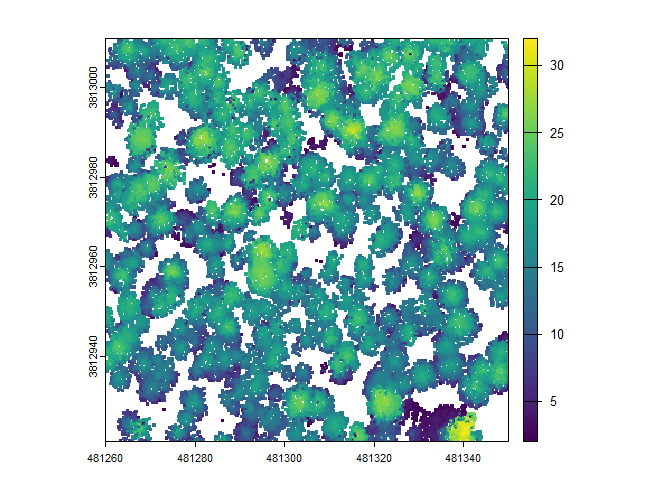
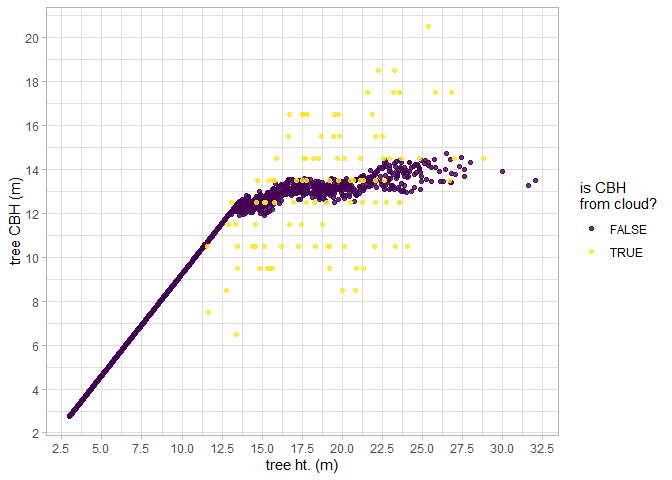
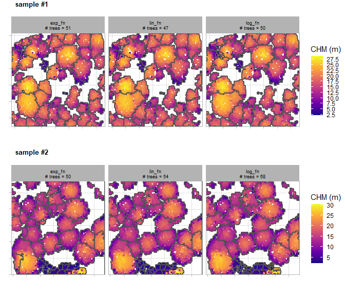
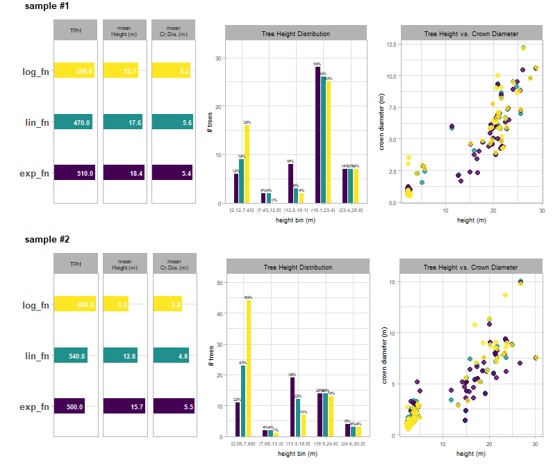
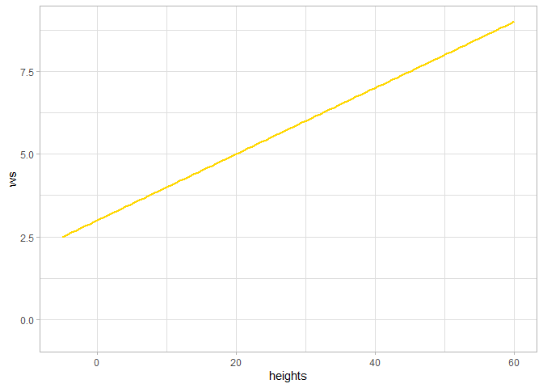
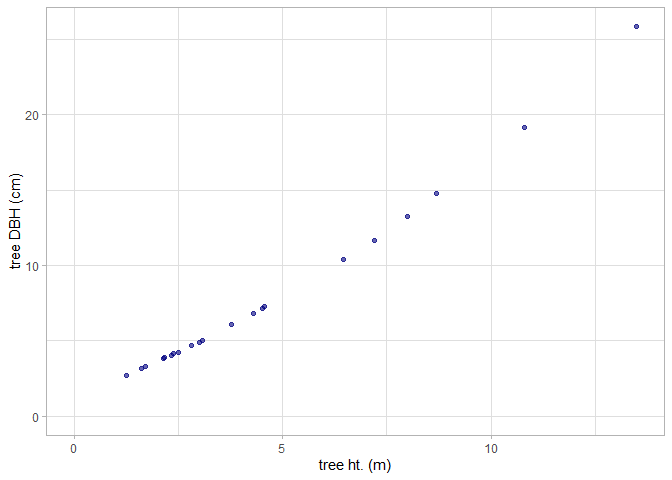

<!-- README.md is generated from README.Rmd. Please edit that file -->

# cloud2trees

<!-- badges: start -->
<!-- badges: end -->

The goal of cloud2trees is to provide accessible routines for processing
point cloud data collected by airborne lidar or developed using UAS
imagery and photogrammetry (e.g. structure from motion). The cloud2trees
package implements some of the methods outlined in the literature below.
Some of the methodologies implemented in the cloud2trees package have
been developed specifically to quantify *conifer* forest structure and
may not be appropriate for other uses.

- Swayze, Neal C., and Wade T. Tinkham. [“Application of unmanned aerial
  system structure from motion point cloud detected tree heights and
  stem diameters to model missing stem
  diameters.”](https://scholar.google.com/scholar?oi=bibs&hl=en&cluster=10655866445299954513)
  MethodsX 9 (2022): 101729.
- Tinkham, Wade T., Neal C. Swayze, Chad M. Hoffman, Lauren E. Lad, and
  Mike A. Battaglia. [“Modeling the missing DBHs: Influence of model
  form on UAV DBH
  characterization.”](https://scholar.google.com/scholar?oi=bibs&hl=en&cluster=14807895789640069059)
  Forests 13, no. 12 (2022): 2077.
- Creasy, Matthew B., Wade T. Tinkham, Chad M. Hoffman, and Jody C.
  Vogeler. [“Potential for individual tree monitoring in ponderosa pine
  dominated forests using unmanned aerial system structure from motion
  point
  clouds.”](https://scholar.google.com/scholar?oi=bibs&hl=en&cluster=10356932785437169630)
  Canadian Journal of Forest Research 51, no. 8 (2021): 1093-1105.
- Kane, Van R., Bryce N. Bartl-Geller, Gina R. Cova, Caden P.
  Chamberlain, Liz van Wagtendonk, and Malcolm P. North. [“Where are the
  large trees? A census of Sierra Nevada large trees to determine their
  frequency and spatial distribution across three large
  landscapes.”](https://scholar.google.com/scholar?cluster=18100846251549158494&hl=en&as_sdt=0,6)
  Forest Ecology and Management 546 (2023): 121351.
- Almeida, Danilo Roberti Alves de, Scott C. Stark, Gang Shao, Juliana
  Schietti, Bruce Walker Nelson, Carlos Alberto Silva, Eric Bastos
  Gorgens, Ruben Valbuena, Daniel de Almeida Papa, and Pedro Henrique
  Santin Brancalion. [“Optimizing the remote detection of tropical
  rainforest structure with airborne lidar: Leaf area profile
  sensitivity to pulse density and spatial
  sampling.”](https://scholar.google.com/scholar?cluster=5085674356305592014&hl=en&as_sdt=0,6)
  Remote Sensing 11, no. 1 (2019): 92.
- Viedma, O., C. A. Silva, J. M. Moreno, and A. T. Hudak.
  [“LadderFuelsR: A new automated tool for vertical fuel continuity
  analysis and crown base height detection using light detection and
  ranging.”](https://scholar.google.com/scholar?cluster=14042621889986838235&oi=gsb&hl=en&as_sdt=0,6)
  Methods in Ecology and Evolution (2024).

## Installation

The `cloud2trees` package relies on the `lasR` package
(<https://r-lidar.github.io/lasR/>) which must be manually installed
first.

You can install the development version of `cloud2trees` from
[GitHub](https://github.com/) with:

``` r
# install.packages("pak")
## first install lasR
pak::pak("r-lidar/lasR", upgrade = TRUE)
## get cloud2trees
pak::pak("georgewoolsey/cloud2trees", upgrade = TRUE)
```

Additionally, if you wish to estimate crown base height (CBH) as part of
the point cloud processing the `LadderFuelsR` package
(<https://github.com/olgaviedma/LadderFuelsR>) and `leafR` package
(<https://github.com/DRAAlmeida/leafR>) must be manually installed
first.

``` r
# install.packages("pak")
## install LadderFuelsR
pak::pak("olgaviedma/LadderFuelsR", upgrade = TRUE)
## install leafR
pak::pak("DRAAlmeida/leafR", upgrade = TRUE)
```

## Preliminaries

To estimate tree DBH from extracted tree height data requires training
data to model diameter using height. Site-specific allometric equations
using data from the USDA Forest Service’s Forest Inventory Analysis
(FIA) program are used to estimate individual tree DBH based on the
point cloud-detected tree height.

FIA plots are identified using [TreeMap
2016](https://scholar.google.com/scholar?cluster=10696389844245769168&hl=en&as_sdt=0,6),
a model of FIA plot locations imputed throughout forested areas of the
conterminous United States at 30 m spatial resolution.

You must first download the FIA data (~3 GB) using `get_treemap()` which
only needs to be run the first time you use the `cloud2trees` package.

``` r
library(cloud2trees)
# download the TreeMap data
cloud2trees::get_treemap()
```

We’ll be using the `tidyverse` and `terra` in the examples below.

``` r
# install.packages("tidyverse")
library(tidyverse)
# install.packages("terra")
library(terra)
```

## Extract Trees from Point Cloud: Default

The `cloud2trees()` function is an all-in-one function to process raw
.las\|.laz files to generate a CHM raster (.tif), a DTM raster (.tif),
and a tree list with tree location, height, and DBH.

For our example we’ll use the `MixedConifer.laz` that ships with the
`lidR` package (<https://r-lidar.github.io/lidRbook/>).

A most basic example using all `cloud2trees()` function defaults with a
single .laz file and writing the output to a temporary directory is:

``` r
# a test las file but this could also be a directory path with >1 .las|.laz files
i <- system.file("extdata", "MixedConifer.laz", package="lidR")
# run it
cloud2trees_ans <- cloud2trees::cloud2trees(output_dir = tempdir(), input_las_dir = i)
```

Let’s check out what is included in the return from the `cloud2trees()`
function.

``` r
# what is it?
cloud2trees_ans %>% names()
#> [1] "crowns_sf"   "treetops_sf" "dtm_rast"    "chm_rast"
```

There is a digital terrain model (DTM) raster which we can plot using
`terra::plot()`

``` r
# there's a DTM
cloud2trees_ans$dtm_rast %>% terra::plot()
```


There is a canopy height model (CHM) raster which we can plot using
`terra::plot()`

``` r
# there's a CHM
cloud2trees_ans$chm_rast %>% terra::plot()
```


A spatial data frame with tree crown polygons is returned.

``` r
# there are tree crowns
cloud2trees_ans$crowns_sf %>% dplyr::glimpse()
#> Rows: 343
#> Columns: 22
#> $ treeID                    <chr> "1_481281.4_3813010.9", "2_481294.4_3813010.…
#> $ tree_height_m             <dbl> 22.23, 15.85, 10.06, 13.44, 22.07, 22.48, 22…
#> $ tree_x                    <dbl> 481281.4, 481294.4, 481306.4, 481312.9, 4813…
#> $ tree_y                    <dbl> 3813011, 3813011, 3813011, 3813011, 3813011,…
#> $ crown_area_m2             <dbl> 10.4375, 9.5000, 1.1875, 4.4375, 6.3750, 10.…
#> $ geometry                  <GEOMETRY [m]> MULTIPOLYGON (((481280.5 38..., POL…
#> $ fia_est_dbh_cm            <dbl> NA, NA, NA, NA, NA, NA, NA, NA, NA, NA, NA, …
#> $ fia_est_dbh_cm_lower      <dbl> NA, NA, NA, NA, NA, NA, NA, NA, NA, NA, NA, …
#> $ fia_est_dbh_cm_upper      <dbl> NA, NA, NA, NA, NA, NA, NA, NA, NA, NA, NA, …
#> $ dbh_cm                    <dbl> NA, NA, NA, NA, NA, NA, NA, NA, NA, NA, NA, …
#> $ is_training_data          <lgl> NA, NA, NA, NA, NA, NA, NA, NA, NA, NA, NA, …
#> $ dbh_m                     <dbl> NA, NA, NA, NA, NA, NA, NA, NA, NA, NA, NA, …
#> $ radius_m                  <dbl> NA, NA, NA, NA, NA, NA, NA, NA, NA, NA, NA, …
#> $ basal_area_m2             <dbl> NA, NA, NA, NA, NA, NA, NA, NA, NA, NA, NA, …
#> $ basal_area_ft2            <dbl> NA, NA, NA, NA, NA, NA, NA, NA, NA, NA, NA, …
#> $ ptcld_extracted_dbh_cm    <dbl> NA, NA, NA, NA, NA, NA, NA, NA, NA, NA, NA, …
#> $ ptcld_predicted_dbh_cm    <dbl> NA, NA, NA, NA, NA, NA, NA, NA, NA, NA, NA, …
#> $ tree_cbh_m                <dbl> NA, NA, NA, NA, NA, NA, NA, NA, NA, NA, NA, …
#> $ is_training_cbh           <lgl> NA, NA, NA, NA, NA, NA, NA, NA, NA, NA, NA, …
#> $ comp_trees_per_ha         <dbl> NA, NA, NA, NA, NA, NA, NA, NA, NA, NA, NA, …
#> $ comp_relative_tree_height <dbl> NA, NA, NA, NA, NA, NA, NA, NA, NA, NA, NA, …
#> $ comp_dist_to_nearest_m    <dbl> NA, NA, NA, NA, NA, NA, NA, NA, NA, NA, NA, …
```

Notice that all of the `dbh`, `cbh`, and competition (`comp_`) columns
do not have data. To estimate these values, we need to explicitly tell
the `cloud2trees()` to perform the processing required by setting the
parameters:

- `estimate_tree_dbh=TRUE` for DBH (see also
  [`trees_dbh()`](#trees_dbh)).
- `estimate_tree_cbh=TRUE` for CBH (see also
  [`trees_cbh()`](#trees_cbh))
- `estimate_tree_competition=TRUE` for competition

Let’s plot these tree crown polygons using `ggplot2::ggplot()` with some
custom plot settings.

``` r
cloud2trees_ans$crowns_sf %>% 
  ggplot2::ggplot(mapping = ggplot2::aes(fill = tree_height_m)) + 
  ggplot2::geom_sf() + 
  ggplot2::scale_fill_distiller(palette = "Oranges", name = "tree ht. (m)", direction = 1) +
  ggplot2::theme_void() +
  ggplot2::theme(legend.position = "top", legend.direction = "horizontal")
```


A spatial data frame with tree top points is returned.

``` r
# there are tree top points
cloud2trees_ans$treetops_sf %>% dplyr::glimpse()
#> Rows: 343
#> Columns: 20
#> $ treeID                    <chr> "1_481281.4_3813010.9", "2_481294.4_3813010.…
#> $ tree_height_m             <dbl> 22.23, 15.85, 10.06, 13.44, 22.07, 22.48, 22…
#> $ crown_area_m2             <dbl> 10.4375, 9.5000, 1.1875, 4.4375, 6.3750, 10.…
#> $ fia_est_dbh_cm            <dbl> NA, NA, NA, NA, NA, NA, NA, NA, NA, NA, NA, …
#> $ fia_est_dbh_cm_lower      <dbl> NA, NA, NA, NA, NA, NA, NA, NA, NA, NA, NA, …
#> $ fia_est_dbh_cm_upper      <dbl> NA, NA, NA, NA, NA, NA, NA, NA, NA, NA, NA, …
#> $ dbh_cm                    <dbl> NA, NA, NA, NA, NA, NA, NA, NA, NA, NA, NA, …
#> $ is_training_data          <lgl> NA, NA, NA, NA, NA, NA, NA, NA, NA, NA, NA, …
#> $ dbh_m                     <dbl> NA, NA, NA, NA, NA, NA, NA, NA, NA, NA, NA, …
#> $ radius_m                  <dbl> NA, NA, NA, NA, NA, NA, NA, NA, NA, NA, NA, …
#> $ basal_area_m2             <dbl> NA, NA, NA, NA, NA, NA, NA, NA, NA, NA, NA, …
#> $ basal_area_ft2            <dbl> NA, NA, NA, NA, NA, NA, NA, NA, NA, NA, NA, …
#> $ ptcld_extracted_dbh_cm    <dbl> NA, NA, NA, NA, NA, NA, NA, NA, NA, NA, NA, …
#> $ ptcld_predicted_dbh_cm    <dbl> NA, NA, NA, NA, NA, NA, NA, NA, NA, NA, NA, …
#> $ tree_cbh_m                <dbl> NA, NA, NA, NA, NA, NA, NA, NA, NA, NA, NA, …
#> $ is_training_cbh           <lgl> NA, NA, NA, NA, NA, NA, NA, NA, NA, NA, NA, …
#> $ comp_trees_per_ha         <dbl> NA, NA, NA, NA, NA, NA, NA, NA, NA, NA, NA, …
#> $ comp_relative_tree_height <dbl> NA, NA, NA, NA, NA, NA, NA, NA, NA, NA, NA, …
#> $ comp_dist_to_nearest_m    <dbl> NA, NA, NA, NA, NA, NA, NA, NA, NA, NA, NA, …
#> $ geometry                  <POINT [m]> POINT (481281.4 3813011), POINT (48129…
```

Notice that `cloud2trees_ans$crowns_sf` and
`cloud2trees_ans$treetops_sf` have the *exact same structure* but one is
spatial polygons and the other is spatial points.

Let’s plot these tree top points using `ggplot2::ggplot()` with some
custom plot settings.

``` r
cloud2trees_ans$treetops_sf %>% 
  ggplot2::ggplot(mapping = ggplot2::aes(color = tree_height_m)) + 
  ggplot2::geom_sf() + 
  ggplot2::scale_color_distiller(palette = "Oranges", name = "tree ht. (m)", direction = 1) +
  ggplot2::theme_void() +
  ggplot2::theme(legend.position = "top", legend.direction = "horizontal")
```


It is also the case that the points in `cloud2trees_ans$treetops_sf`
will match to exactly one crown polygon in `cloud2trees_ans$crowns_sf`.

``` r
ggplot2::ggplot() + 
  ggplot2::geom_sf(data = cloud2trees_ans$crowns_sf, mapping = ggplot2::aes(fill = tree_height_m)) + 
  ggplot2::geom_sf(data = cloud2trees_ans$treetops_sf, shape = 20) + 
  ggplot2::scale_fill_distiller(palette = "Oranges", name = "tree ht. (m)", direction = 1) +
  ggplot2::theme_void() +
  ggplot2::theme(legend.position = "top", legend.direction = "horizontal")
```



## Extract Trees from Point Cloud: Custom

We’ll continue to use the `MixedConifer.laz` that ships with the `lidR`
package for our example.

Customizing the `cloud2trees()` function parameters we’ll:

- Change the resolution of the DTM using `dtm_res_m`
- Change the minimum height to classify trees using `min_height`
- Change moving window used to detect the local maxima tree tops using
  `ws`
- Estimate tree DBH using allometry from FIA plot data with
  `estimate_tree_dbh`
- Quantify tree competition metrics with `estimate_tree_competition`
- Extract tree CBH from the point cloud with `estimate_tree_cbh` for a
  sample of 444 trees using `cbh_tree_sample_n`
- Model the remaining tree CBH values with `cbh_estimate_missing_cbh`
  based on our sample of 444 trees

``` r
# run it
cloud2trees_ans_c <- cloud2trees::cloud2trees(
  output_dir = tempdir()
  , input_las_dir = i
  , dtm_res_m = 0.5
  , min_height = 3
  , ws = function(x){x*0.1}
  , estimate_tree_dbh = TRUE
  , estimate_tree_competition = TRUE
  , estimate_tree_cbh = TRUE
  , cbh_tree_sample_n = 444
  , cbh_estimate_missing_cbh = TRUE
)
```

Check how the digital terrain model (DTM) raster has changed

``` r
paste(
  "Default DTM resolution:"
  , cloud2trees_ans$dtm_rast %>% terra::res() %>% paste(collapse = ",")
  , "|| Custom DTM resolution:"
  , cloud2trees_ans_c$dtm_rast %>% terra::res() %>% paste(collapse = ",")
)
#> [1] "Default DTM resolution: 1,1 || Custom DTM resolution: 0.5,0.5"
```

Check that our spatial data frame with tree crown polygons has data in
the `dbh`, `cbh`, and `comp` (i.e. competition) columns.

``` r
cloud2trees_ans_c$crowns_sf %>% dplyr::glimpse()
#> Rows: 2,447
#> Columns: 22
#> $ treeID                    <chr> "1_481281.4_3813010.9", "2_481283.9_3813010.…
#> $ tree_height_m             <dbl> 22.230, 18.350, 21.240, 15.850, 12.520, 5.68…
#> $ tree_x                    <dbl> 481281.4, 481283.9, 481287.6, 481294.4, 4812…
#> $ tree_y                    <dbl> 3813011, 3813011, 3813011, 3813011, 3813011,…
#> $ crown_area_m2             <dbl> 6.7500, 3.3750, 9.2500, 3.5000, 0.9375, 0.31…
#> $ geometry                  <GEOMETRY [m]> POLYGON ((481280.5 3813011,..., POL…
#> $ fia_est_dbh_cm            <dbl> 51.323858, 39.269958, 48.169414, 32.185734, …
#> $ fia_est_dbh_cm_lower      <dbl> 24.129406, 18.794239, 22.916052, 15.134360, …
#> $ fia_est_dbh_cm_upper      <dbl> 86.50807, 65.80713, 80.89456, 53.77792, 39.0…
#> $ dbh_cm                    <dbl> 51.323858, 39.269958, 48.169414, 32.185734, …
#> $ is_training_data          <lgl> FALSE, FALSE, FALSE, FALSE, FALSE, FALSE, FA…
#> $ dbh_m                     <dbl> 0.51323858, 0.39269958, 0.48169414, 0.321857…
#> $ radius_m                  <dbl> 0.25661929, 0.19634979, 0.24084707, 0.160928…
#> $ basal_area_m2             <dbl> 0.206884747, 0.121118578, 0.182235345, 0.081…
#> $ basal_area_ft2            <dbl> 2.22690742, 1.30372037, 1.96158126, 0.875770…
#> $ ptcld_extracted_dbh_cm    <dbl> NA, NA, NA, NA, NA, NA, NA, NA, NA, NA, NA, …
#> $ ptcld_predicted_dbh_cm    <dbl> NA, NA, NA, NA, NA, NA, NA, NA, NA, NA, NA, …
#> $ tree_cbh_m                <dbl> 18.500000, 13.455123, 13.703097, 13.344988, …
#> $ is_training_cbh           <lgl> TRUE, FALSE, FALSE, FALSE, FALSE, FALSE, FAL…
#> $ comp_trees_per_ha         <dbl> 990.0593, 990.0593, 2227.6334, 5445.3261, 54…
#> $ comp_relative_tree_height <dbl> 0.9099468, 0.8115878, 0.8780488, 1.0000000, …
#> $ comp_dist_to_nearest_m    <dbl> 2.5000000, 2.5000000, 2.6100766, 1.5206906, …
```

Remember, we also changed the `ws` parameter used to detect the local
maxima for identifying tree tops so we got a lot more trees compared to
the default settings.

``` r
paste(
  "Default trees extracted:"
  , cloud2trees_ans$crowns_sf %>% nrow()
  , "|| Custom trees extracted:"
  , cloud2trees_ans_c$crowns_sf %>% nrow()
)
#> [1] "Default trees extracted: 343 || Custom trees extracted: 2447"
```

Let’s look at the relationship between tree height and tree DBH
estimated from the FIA plot data.

``` r
cloud2trees_ans_c$crowns_sf %>%
  ggplot2::ggplot(mapping = ggplot2::aes(x = tree_height_m, y = dbh_cm)) + 
  ggplot2::geom_point(color = "navy", alpha = 0.6) +
  ggplot2::labs(x = "tree ht. (m)", y = "tree DBH (cm)") +
  ggplot2::scale_x_continuous(limits = c(0,NA)) +
  ggplot2::scale_y_continuous(limits = c(0,NA)) +
  ggplot2::theme_light()
```


Let’s look at the relationship between tree height and tree CBH as
extracted from the point cloud. Note, that we do not expect a perfect
linear relationship between tree height and CBH throughout the entire
height range because CBH is also determined spatially (e.g. as a fire
moves through a stand).

``` r
cloud2trees_ans_c$crowns_sf %>%
  dplyr::arrange(is_training_cbh) %>%
  ggplot2::ggplot(mapping = ggplot2::aes(x = tree_height_m, y = tree_cbh_m, color=is_training_cbh)) + 
  ggplot2::geom_point() +
  ggplot2::labs(x = "tree ht. (m)", y = "tree CBH (m)") +
  ggplot2::scale_y_continuous(breaks = scales::extended_breaks(n=12)) +
  ggplot2::scale_x_continuous(breaks = scales::extended_breaks(n=14)) +
  ggplot2::scale_color_viridis_d(alpha = 0.8, name = "is CBH\nfrom cloud?") +
  ggplot2::theme_light()
```



We can also plot height, diameter, and CBH of trees spatially and we’ll
use the `patchwork` package to combine our plots.

``` r
library(patchwork)
# height plot
plt_ht <-
  cloud2trees_ans_c$crowns_sf %>% 
  ggplot2::ggplot(mapping = ggplot2::aes(fill = tree_height_m)) + 
  ggplot2::geom_sf() + 
  ggplot2::scale_fill_distiller(palette = "Oranges", name = "tree ht. (m)", direction = 1) +
  ggplot2::theme_void() +
  ggplot2::theme(legend.position = "top", legend.direction = "horizontal")
# diameter plot
plt_dbh <-
  cloud2trees_ans_c$crowns_sf %>% 
  ggplot2::ggplot(mapping = ggplot2::aes(fill = dbh_cm)) + 
  ggplot2::geom_sf() + 
  ggplot2::scale_fill_distiller(palette = "Purples", name = "tree DBH (cm)", direction = 1) +
  ggplot2::theme_void() +
  ggplot2::theme(legend.position = "top", legend.direction = "horizontal")
# CBH plot
plt_cbh <-
  cloud2trees_ans_c$crowns_sf %>% 
  ggplot2::ggplot(mapping = ggplot2::aes(fill = tree_cbh_m)) + 
  ggplot2::geom_sf() + 
  ggplot2::scale_fill_distiller(palette = "Greens", name = "tree CBH (m)", direction = 1) +
  ggplot2::theme_void() +
  ggplot2::theme(legend.position = "top", legend.direction = "horizontal")
# combine with patchwork
plt_ht + plt_dbh + plt_cbh + patchwork::plot_layout(ncol = 2) &
  ggplot2::theme(
    legend.title = ggplot2::element_text(size = 8)
    , legend.text = ggplot2::element_text(size = 7)
  )
```



Let’s plot the distance to the nearest tree that we obtained by turning
on the `estimate_tree_competition` parameter in the `cloud2trees()`
function call to quantify tree competition metrics. We’ll use the
spatial tree points data in `cloud2trees_ans_c$treetops_sf`.

``` r
cloud2trees_ans_c$treetops_sf %>%
  ggplot2::ggplot(mapping = ggplot2::aes(color = comp_dist_to_nearest_m)) + 
  ggplot2::geom_sf() +
  ggplot2::scale_color_distiller(palette = "Greys", name = "distance to\nnearest tree", direction = 1) +
  ggplot2::theme_void() +
  ggplot2::theme(legend.position = "top", legend.direction = "horizontal")
```



## Extract Raster Data from Point Cloud

We can use the `cloud2raster()` function if we only want to create a DTM
and CHM from our point cloud data.

``` r
cloud2raster_ans <- cloud2trees::cloud2raster(output_dir = tempdir(), input_las_dir = i)
```

There is a digital terrain model (DTM) raster which we can plot using
`terra::plot()`

``` r
# there's a DTM
cloud2raster_ans$dtm_rast %>% terra::plot()
```


There is a canopy height model (CHM) raster which we can plot using
`terra::plot()`

``` r
# there's a CHM
cloud2raster_ans$chm_rast %>% terra::plot()
```


## Extract Trees from Raster Data

We can use the `raster2trees()` function if we already have a CHM raster
and want to extract a tree list.

We’ll use the CHM example that ships with the `cloud2trees` package.

``` r
# read example CHM raster
f <- paste0(system.file(package = "cloud2trees"),"/extdata/chm.tif")
r <- terra::rast(f)
# extract trees from raster
raster2trees_ans <- cloud2trees::raster2trees(chm_rast = r, outfolder = tempdir())
```

A spatial data frame with tree crown polygons is returned.

``` r
# there are tree crowns
raster2trees_ans %>% dplyr::glimpse()
#> Rows: 151
#> Columns: 6
#> $ treeID        <chr> "1_458054.1_4450092.9", "2_458055.9_4450092.9", "3_45806…
#> $ tree_height_m <dbl> 4.599, 5.130, 10.641, 4.610, 8.957, 10.310, 6.515, 4.271…
#> $ tree_x        <dbl> 458054.1, 458055.9, 458064.9, 458078.4, 458067.6, 458044…
#> $ tree_y        <dbl> 4450093, 4450093, 4450093, 4450093, 4450092, 4450092, 44…
#> $ crown_area_m2 <dbl> 0.5625, 0.3750, 1.8750, 1.0000, 3.3125, 5.0000, 1.3750, …
#> $ geometry      <GEOMETRY [m]> POLYGON ((458054 4450093, 4..., POLYGON ((45805…
```

Let’s plot these tree crown polygons using `ggplot2::ggplot()` with some
custom plot settings.

``` r
raster2trees_ans %>% 
  ggplot2::ggplot(mapping = ggplot2::aes(fill = tree_height_m)) + 
  ggplot2::geom_sf() + 
  ggplot2::scale_fill_distiller(palette = "Oranges", name = "tree ht. (m)", direction = 1) +
  ggplot2::theme_void() +
  ggplot2::theme(legend.position = "top", legend.direction = "horizontal")
```



## Estimate Tree DBH for a Tree List

If we already have a list of trees with tree coordinate and tree height
data, we can estimate tree DBH using a site-specific allometric equation
based on FIA data with the `trees_dbh()` function.

We just need to pass a data frame with the columns `treeID`, `tree_x`,
`tree_y`, and `tree_height_m` to the `trees_dbh()` function.

``` r
# a fake tree list
tl <- dplyr::tibble(
    treeID = c(1:21)
    , tree_x = rnorm(n=21, mean = 458064, sd = 11)
    , tree_y = rnorm(n=21, mean = 4450074, sd = 11)
    , tree_height_m = exp(rgamma(n = 21, shape = (7/4)^2, rate = (4^2)/7))
  )
```

Use the `trees_dbh()` function to estimate DBH based on tree height and
tree location.

``` r
# call the function
tl_dbh <- cloud2trees::trees_dbh(tree_list = tl, crs = "32613")
```

What is this data?

``` r
tl_dbh %>% dplyr::glimpse()
#> Rows: 21
#> Columns: 16
#> $ treeID                 <chr> "1", "2", "3", "4", "5", "6", "7", "8", "9", "1…
#> $ tree_x                 <dbl> 458072.7, 458092.2, 458076.1, 458062.7, 458058.…
#> $ tree_y                 <dbl> 4450074, 4450083, 4450099, 4450077, 4450065, 44…
#> $ tree_height_m          <dbl> 6.312101, 3.173333, 2.400281, 2.171915, 4.26695…
#> $ geometry               <POINT [m]> POINT (458072.7 4450074), POINT (458092.2…
#> $ fia_est_dbh_cm         <dbl> 10.030254, 5.168607, 4.104514, 3.854134, 6.7353…
#> $ fia_est_dbh_cm_lower   <dbl> 4.484711, 2.284500, 1.835422, 1.749194, 2.94032…
#> $ fia_est_dbh_cm_upper   <dbl> 17.260292, 8.995837, 7.037332, 6.699721, 11.672…
#> $ dbh_cm                 <dbl> 10.030254, 5.168607, 4.104514, 3.854134, 6.7353…
#> $ is_training_data       <lgl> FALSE, FALSE, FALSE, FALSE, FALSE, FALSE, FALSE…
#> $ dbh_m                  <dbl> 0.10030254, 0.05168607, 0.04104514, 0.03854134,…
#> $ radius_m               <dbl> 0.05015127, 0.02584304, 0.02052257, 0.01927067,…
#> $ basal_area_m2          <dbl> 0.0079015770, 0.0020981521, 0.0013231628, 0.001…
#> $ basal_area_ft2         <dbl> 0.085052575, 0.022584509, 0.014242524, 0.012557…
#> $ ptcld_extracted_dbh_cm <dbl> NA, NA, NA, NA, NA, NA, NA, NA, NA, NA, NA, NA,…
#> $ ptcld_predicted_dbh_cm <dbl> NA, NA, NA, NA, NA, NA, NA, NA, NA, NA, NA, NA,…
```

Let’s look at the relationship between tree height and tree DBH
estimated from the FIA plot data.

``` r
tl_dbh %>%
  ggplot2::ggplot(mapping = ggplot2::aes(x = tree_height_m, y = dbh_cm)) + 
  ggplot2::geom_point(color = "navy", alpha = 0.6) +
  ggplot2::labs(x = "tree ht. (m)", y = "tree DBH (cm)") +
  ggplot2::scale_x_continuous(limits = c(0,NA)) +
  ggplot2::scale_y_continuous(limits = c(0,NA)) +
  ggplot2::theme_light()
```


We can look at this data spatially too.

``` r
# height plot
plt_ht2 <-
  tl_dbh %>% 
  ggplot2::ggplot(mapping = ggplot2::aes(color = tree_height_m)) + 
  ggplot2::geom_sf(size = 3) + 
  ggplot2::scale_color_distiller(palette = "Oranges", name = "tree ht. (m)", direction = 1) +
  ggplot2::theme_void() +
  ggplot2::theme(
    legend.position = "top", legend.direction = "horizontal"
    , panel.border = ggplot2::element_rect(color = "black", fill = NA)
  )
# diameter plot
plt_dbh2 <-
  tl_dbh %>% 
  ggplot2::ggplot(mapping = ggplot2::aes(color = dbh_cm)) + 
  ggplot2::geom_sf(size = 3) + 
  ggplot2::scale_color_distiller(palette = "Purples", name = "tree DBH (cm)", direction = 1) +
  ggplot2::theme_void() +
  ggplot2::theme(
    legend.position = "top", legend.direction = "horizontal"
    , panel.border = ggplot2::element_rect(color = "black", fill = NA)
  )
# combine with patchwork
plt_ht2 + plt_dbh2
```


## Estimate Tree CBH for a Tree List

If you wish to estimate crown base height (CBH) as part of the point
cloud processing the `LadderFuelsR` package
(<https://github.com/olgaviedma/LadderFuelsR>) and `leafR` package
(<https://github.com/DRAAlmeida/leafR>) must be manually installed
first.

``` r
# install.packages("pak")
## install LadderFuelsR
pak::pak("olgaviedma/LadderFuelsR", upgrade = TRUE)
## install leafR
pak::pak("DRAAlmeida/leafR", upgrade = TRUE)
```

After installing these packages, if we already have spatial polygons of
tree crowns and height normalized point cloud data, we can attempt to
extract tree CBH from the point cloud using the `trees_cbh()` function.

We just need to pass a `sf` class object with POLYGON geometry and the
columns `treeID` and `tree_height_m` and the height normalized point
cloud data to the `trees_cbh()` function.

We’ll use the tree crown polygons and normalized point cloud data
examples that ship with the `cloud2trees` package.

``` r
# read example crown polygons
f <- paste0(system.file(package = "cloud2trees"),"/extdata/crowns_poly.gpkg")
p <- sf::st_read(f, quiet = T)
# path to the normalized point cloud data
nlas <- paste0(system.file(package = "cloud2trees"),"/extdata/norm_las")
# call the function
trees_cbh_ans <- cloud2trees::trees_cbh(
  trees_poly = p
  , norm_las = nlas
  , tree_sample_prop = 0.4
  , estimate_missing_cbh = TRUE
)
```

What is this data?

``` r
trees_cbh_ans %>% dplyr::glimpse()
#> Rows: 196
#> Columns: 22
#> $ treeID                    <chr> "1_458054.1_4450092.9", "2_458055.9_4450092.…
#> $ tree_height_m             <dbl> 4.599, 5.130, 10.641, 4.610, 4.599, 8.957, 1…
#> $ tree_x                    <dbl> 458054.1, 458055.9, 458064.9, 458078.4, 4580…
#> $ tree_y                    <dbl> 4450093, 4450093, 4450093, 4450093, 4450092,…
#> $ crown_area_m2             <dbl> 0.1875, 0.3750, 1.8750, 0.7500, 0.3750, 3.37…
#> $ fia_est_dbh_cm            <dbl> 7.319132, 8.019020, 19.016688, 7.319132, 7.3…
#> $ fia_est_dbh_cm_lower      <dbl> 3.255010, 3.515282, 8.424208, 3.255010, 3.25…
#> $ fia_est_dbh_cm_upper      <dbl> 12.58250, 13.93920, 32.91103, 12.58250, 12.5…
#> $ dbh_cm                    <dbl> 7.319132, 8.019020, 19.016688, 7.319132, 7.3…
#> $ is_training_data          <lgl> FALSE, FALSE, FALSE, FALSE, FALSE, FALSE, FA…
#> $ dbh_m                     <dbl> 0.07319132, 0.08019020, 0.19016688, 0.073191…
#> $ radius_m                  <dbl> 0.03659566, 0.04009510, 0.09508344, 0.036595…
#> $ basal_area_m2             <dbl> 0.004207353, 0.005050479, 0.028402703, 0.004…
#> $ basal_area_ft2            <dbl> 0.04528795, 0.05436335, 0.30572669, 0.045287…
#> $ ptcld_extracted_dbh_cm    <dbl> NA, NA, NA, NA, NA, NA, NA, NA, NA, NA, NA, …
#> $ ptcld_predicted_dbh_cm    <dbl> NA, NA, NA, NA, NA, NA, NA, NA, NA, NA, NA, …
#> $ comp_trees_per_ha         <dbl> NA, NA, NA, NA, NA, NA, NA, NA, NA, NA, NA, …
#> $ comp_relative_tree_height <dbl> NA, NA, NA, NA, NA, NA, NA, NA, NA, NA, NA, …
#> $ comp_dist_to_nearest_m    <dbl> NA, NA, NA, NA, NA, NA, NA, NA, NA, NA, NA, …
#> $ tree_cbh_m                <dbl> 3.261758, 3.282190, 4.053798, 1.500000, 3.25…
#> $ is_training_cbh           <lgl> FALSE, FALSE, FALSE, TRUE, FALSE, FALSE, FAL…
#> $ geom                      <MULTIPOLYGON [m]> MULTIPOLYGON (((458054 4450...,…
```

Let’s look at the relationship between tree height and tree CBH as
extracted from the point cloud. Note, that we do not expect a perfect
linear relationship between tree height and CBH throughout the entire
height range because CBH is also determined spatially (e.g. as a fire
moves through a stand).

``` r
trees_cbh_ans %>%
  dplyr::arrange(is_training_cbh) %>%
  ggplot2::ggplot(mapping = ggplot2::aes(x = tree_height_m, y = tree_cbh_m, color=is_training_cbh)) + 
  ggplot2::geom_point() +
  ggplot2::labs(x = "tree ht. (m)", y = "tree CBH (m)") +
  ggplot2::scale_y_continuous(breaks = scales::extended_breaks(n=12)) +
  ggplot2::scale_x_continuous(breaks = scales::extended_breaks(n=14)) +
  ggplot2::scale_color_viridis_d(alpha = 0.8, name = "is CBH\nfrom cloud?") +
  ggplot2::theme_light()
```


We can look at this data spatially too.

``` r
trees_cbh_ans %>%
  dplyr::arrange(is_training_cbh) %>%
  ggplot2::ggplot(mapping = ggplot2::aes(fill = tree_cbh_m, color=is_training_cbh)) + 
  ggplot2::geom_sf() +
  ggplot2::scale_color_viridis_d(alpha = 0.8, name = "is CBH\nfrom cloud?") +
  ggplot2::scale_fill_distiller(palette = "Greens", name = "tree CBH (m)", direction = 1) +
  ggplot2::theme_void() +
  ggplot2::theme(
    legend.position = "top", legend.direction = "horizontal"
    , panel.border = ggplot2::element_rect(color = "black", fill = NA)
  ) +
  ggplot2::guides(
    color = ggplot2::guide_legend(override.aes = list(lwd = 3, fill = NA))
  )
```


