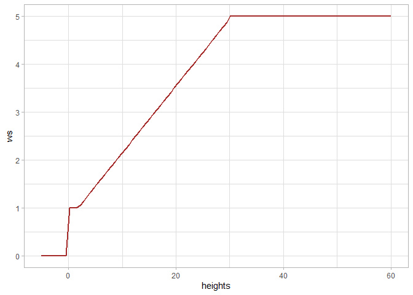
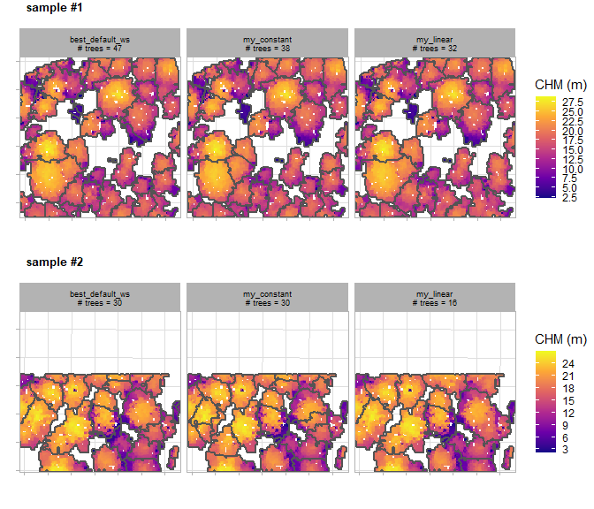
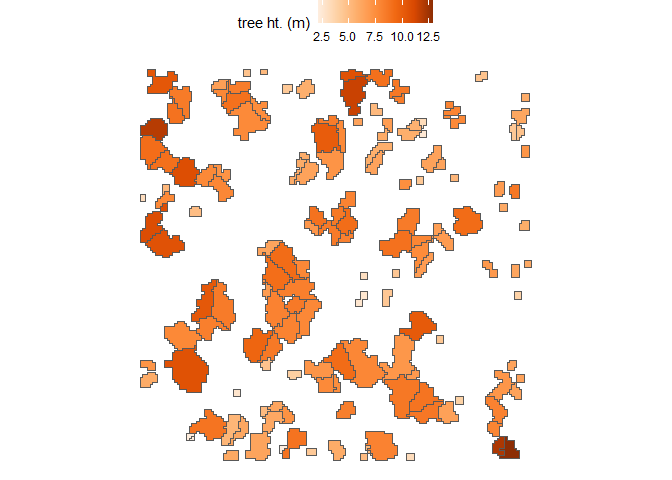

<!-- README.md is generated from README.Rmd. Please edit that file -->

# cloud2trees

<!-- badges: start -->
<!-- badges: end -->

The goal of cloud2trees is to provide accessible routines for processing
point cloud data collected by airborne lidar or developed using UAS
imagery and photogrammetry (e.g. structure from motion). The cloud2trees
package implements some of the methods outlined in the literature below.
Some of the methodologies implemented in the cloud2trees package have
been developed specifically to quantify *conifer* forest structure and
may not be applicable for other uses.

- [Swayze, Neal C., and Wade T. Tinkham. “Application of unmanned aerial
  system structure from motion point cloud detected tree heights and
  stem diameters to model missing stem diameters.” MethodsX 9 (2022):
  101729.](https://scholar.google.com/scholar?oi=bibs&hl=en&cluster=10655866445299954513)
- [Tinkham, Wade T., Neal C. Swayze, Chad M. Hoffman, Lauren E. Lad, and
  Mike A. Battaglia. “Modeling the missing DBHs: Influence of model form
  on UAV DBH characterization.” Forests 13, no. 12 (2022):
  2077.](https://scholar.google.com/scholar?oi=bibs&hl=en&cluster=14807895789640069059)
- [Creasy, Matthew B., Wade T. Tinkham, Chad M. Hoffman, and Jody C.
  Vogeler. “Potential for individual tree monitoring in ponderosa pine
  dominated forests using unmanned aerial system structure from motion
  point clouds.” Canadian Journal of Forest Research 51, no. 8 (2021):
  1093-1105.](https://scholar.google.com/scholar?oi=bibs&hl=en&cluster=10356932785437169630)
- [Kane, Van R., Bryce N. Bartl-Geller, Gina R. Cova, Caden P.
  Chamberlain, Liz van Wagtendonk, and Malcolm P. North. “Where are the
  large trees? A census of Sierra Nevada large trees to determine their
  frequency and spatial distribution across three large landscapes.”
  Forest Ecology and Management 546 (2023):
  121351.](https://scholar.google.com/scholar?cluster=18100846251549158494&hl=en&as_sdt=0,6)

## Installation

The `cloud2trees` package relies on the `lasR` package which must be
manually installed first.

You can install the development version of cloud2trees from
[GitHub](https://github.com/) with:

``` r
# install.packages("pak")
# first install lasR
pak::pak("r-lidar/lasR", upgrade = TRUE)
# get cloud2trees
pak::pak("georgewoolsey/cloud2trees")
```

## Preliminaries

To estimate tree DBH from extracted tree height data requires training
data to model diameter using height. Site-specific allometric equations
using data from the USDA Forest Service’s Forest Inventory Analysis
(FIA) program are used to estimate individual tree DBH based on the
point cloud-detected tree height.

FIA plots are identified using [TreeMap
2016](https://scholar.google.com/scholar?cluster=10696389844245769168&hl=en&as_sdt=0,6),
a model of FIA plot locations imputed throughout forested areas of the
conterminous United States at 30 m spatial resolution.

You must first download the FIA data (~3 GB) using `get_treemap()` which
only needs to be run the first time you use the `cloud2trees` package.

``` r
library(cloud2trees)
# download the TreeMap data
cloud2trees::get_treemap()
```

We’ll be using the `tidyverse` in the examples below.

``` r
# install.packages("tidyverse")
library(tidyverse)
```

## Extract Trees from Point Cloud: Default

The `cloud2trees()` function is an all-in-one function to process raw
.las\|.laz files to generate a CHM raster (.tif), a DTM raster (.tif),
and a tree list with tree location, height, and DBH.

For our example we’ll use the `MixedConifer.laz` that ships with the
`lidR` package (<https://r-lidar.github.io/lidRbook/>).

A most basic example using all `cloud2trees()` function defaults with a
single .laz file and writing the output to a temporary directory is:

``` r
# a test las file but this could also be a directory path with >1 .las|.laz files
i <- list.files(system.file(package = "lidR", "extdata/"), recursive = T, full.names = T) %>%
     tolower() %>%
     stringr::str_subset("mixedconifer") %>%
     stringr::str_subset(".*\\.(laz|las)$")
# run it
cloud2trees_ans <- cloud2trees::cloud2trees(output_dir = tempdir(), input_las_dir = i)
```

Let’s check out what is included in the return from the `cloud2trees()`
function.

``` r
# what is it?
cloud2trees_ans %>% names()
#> [1] "crowns_sf"   "treetops_sf" "dtm_rast"    "chm_rast"
```

There is a digital terrain model (DTM) raster which we can plot using
`terra::plot()`

``` r
# there's a DTM
cloud2trees_ans$dtm_rast %>% terra::plot()
```


There is a canopy height model (CHM) raster which we can plot using
`terra::plot()`

``` r
# there's a CHM
cloud2trees_ans$chm_rast %>% terra::plot()
```


A spatial data frame with tree crown polygons is returned.

``` r
# there are tree crowns
cloud2trees_ans$crowns_sf %>% dplyr::glimpse()
#> Rows: 343
#> Columns: 20
#> $ treeID                    <chr> "1_481281.4_3813010.9", "2_481294.4_3813010.…
#> $ tree_height_m             <dbl> 22.23, 15.85, 10.06, 13.44, 22.07, 22.48, 22…
#> $ tree_x                    <dbl> 481281.4, 481294.4, 481306.4, 481312.9, 4813…
#> $ tree_y                    <dbl> 3813011, 3813011, 3813011, 3813011, 3813011,…
#> $ crown_area_m2             <dbl> 10.4375, 9.5000, 1.1875, 4.4375, 6.3750, 10.…
#> $ geometry                  <GEOMETRY [m]> MULTIPOLYGON (((481280.5 38..., POL…
#> $ fia_est_dbh_cm            <dbl> NA, NA, NA, NA, NA, NA, NA, NA, NA, NA, NA, …
#> $ fia_est_dbh_cm_lower      <dbl> NA, NA, NA, NA, NA, NA, NA, NA, NA, NA, NA, …
#> $ fia_est_dbh_cm_upper      <dbl> NA, NA, NA, NA, NA, NA, NA, NA, NA, NA, NA, …
#> $ dbh_cm                    <dbl> NA, NA, NA, NA, NA, NA, NA, NA, NA, NA, NA, …
#> $ is_training_data          <lgl> NA, NA, NA, NA, NA, NA, NA, NA, NA, NA, NA, …
#> $ dbh_m                     <dbl> NA, NA, NA, NA, NA, NA, NA, NA, NA, NA, NA, …
#> $ radius_m                  <dbl> NA, NA, NA, NA, NA, NA, NA, NA, NA, NA, NA, …
#> $ basal_area_m2             <dbl> NA, NA, NA, NA, NA, NA, NA, NA, NA, NA, NA, …
#> $ basal_area_ft2            <dbl> NA, NA, NA, NA, NA, NA, NA, NA, NA, NA, NA, …
#> $ ptcld_extracted_dbh_cm    <dbl> NA, NA, NA, NA, NA, NA, NA, NA, NA, NA, NA, …
#> $ ptcld_predicted_dbh_cm    <dbl> NA, NA, NA, NA, NA, NA, NA, NA, NA, NA, NA, …
#> $ comp_trees_per_ha         <dbl> NA, NA, NA, NA, NA, NA, NA, NA, NA, NA, NA, …
#> $ comp_relative_tree_height <dbl> NA, NA, NA, NA, NA, NA, NA, NA, NA, NA, NA, …
#> $ comp_dist_to_nearest_m    <dbl> NA, NA, NA, NA, NA, NA, NA, NA, NA, NA, NA, …
```

Notice that all of the `dbh` columns do not have data. That’s because we
did not tell the `cloud2trees()` to estimate DBH values by setting the
`estimate_tree_dbh` parameter to `TRUE`.

Let’s plot these tree crown polygons using `ggplot2::ggplot()` with some
custom plot settings.

``` r
cloud2trees_ans$crowns_sf %>% 
  ggplot2::ggplot(mapping = ggplot2::aes(fill = tree_height_m)) + 
  ggplot2::geom_sf() + 
  ggplot2::scale_fill_distiller(palette = "Oranges", name = "tree ht. (m)", direction = 1) +
  ggplot2::theme_void() +
  ggplot2::theme(legend.position = "top", legend.direction = "horizontal")
```


A spatial data frame with tree top points is returned.

``` r
# there are tree top points
cloud2trees_ans$treetops_sf %>% dplyr::glimpse()
#> Rows: 343
#> Columns: 18
#> $ treeID                    <chr> "1_481281.4_3813010.9", "2_481294.4_3813010.…
#> $ tree_height_m             <dbl> 22.23, 15.85, 10.06, 13.44, 22.07, 22.48, 22…
#> $ crown_area_m2             <dbl> 10.4375, 9.5000, 1.1875, 4.4375, 6.3750, 10.…
#> $ fia_est_dbh_cm            <dbl> NA, NA, NA, NA, NA, NA, NA, NA, NA, NA, NA, …
#> $ fia_est_dbh_cm_lower      <dbl> NA, NA, NA, NA, NA, NA, NA, NA, NA, NA, NA, …
#> $ fia_est_dbh_cm_upper      <dbl> NA, NA, NA, NA, NA, NA, NA, NA, NA, NA, NA, …
#> $ dbh_cm                    <dbl> NA, NA, NA, NA, NA, NA, NA, NA, NA, NA, NA, …
#> $ is_training_data          <lgl> NA, NA, NA, NA, NA, NA, NA, NA, NA, NA, NA, …
#> $ dbh_m                     <dbl> NA, NA, NA, NA, NA, NA, NA, NA, NA, NA, NA, …
#> $ radius_m                  <dbl> NA, NA, NA, NA, NA, NA, NA, NA, NA, NA, NA, …
#> $ basal_area_m2             <dbl> NA, NA, NA, NA, NA, NA, NA, NA, NA, NA, NA, …
#> $ basal_area_ft2            <dbl> NA, NA, NA, NA, NA, NA, NA, NA, NA, NA, NA, …
#> $ ptcld_extracted_dbh_cm    <dbl> NA, NA, NA, NA, NA, NA, NA, NA, NA, NA, NA, …
#> $ ptcld_predicted_dbh_cm    <dbl> NA, NA, NA, NA, NA, NA, NA, NA, NA, NA, NA, …
#> $ comp_trees_per_ha         <dbl> NA, NA, NA, NA, NA, NA, NA, NA, NA, NA, NA, …
#> $ comp_relative_tree_height <dbl> NA, NA, NA, NA, NA, NA, NA, NA, NA, NA, NA, …
#> $ comp_dist_to_nearest_m    <dbl> NA, NA, NA, NA, NA, NA, NA, NA, NA, NA, NA, …
#> $ geometry                  <POINT [m]> POINT (481281.4 3813011), POINT (48129…
```

Notice that `cloud2trees_ans$crowns_sf` and
`cloud2trees_ans$treetops_sf` have the *exact same structure* but one is
spatial polygons and the other is spatial points.

Let’s plot these tree top points using `ggplot2::ggplot()` with some
custom plot settings.

``` r
cloud2trees_ans$treetops_sf %>% 
  ggplot2::ggplot(mapping = ggplot2::aes(color = tree_height_m)) + 
  ggplot2::geom_sf() + 
  ggplot2::scale_color_distiller(palette = "Oranges", name = "tree ht. (m)", direction = 1) +
  ggplot2::theme_void() +
  ggplot2::theme(legend.position = "top", legend.direction = "horizontal")
```


It is also the case that the points in `cloud2trees_ans$treetops_sf`
will match to exactly one crown polygon in `cloud2trees_ans$crowns_sf`.

``` r
ggplot2::ggplot() + 
  ggplot2::geom_sf(data = cloud2trees_ans$crowns_sf, mapping = ggplot2::aes(fill = tree_height_m)) + 
  ggplot2::geom_sf(data = cloud2trees_ans$treetops_sf, shape = 20) + 
  ggplot2::scale_fill_distiller(palette = "Oranges", name = "tree ht. (m)", direction = 1) +
  ggplot2::theme_void() +
  ggplot2::theme(legend.position = "top", legend.direction = "horizontal")
```


## Extract Trees from Point Cloud: Custom

We’ll continue to use the `MixedConifer.laz` that ships with the `lidR`
package for our example.

Customizing the `cloud2trees()` function parameters we’ll:

- Change the resolution of the DTM using `dtm_res_m`
- Change the minimum height to classify trees using `min_height`
- Change moving window used to detect the local maxima tree tops using
  `ws`
- Estimate tree DBH using allometry from FIA plot data with
  `estimate_tree_dbh`
- Quantify tree competition metrics with `estimate_tree_competition`

``` r
# run it
cloud2trees_ans_c <- cloud2trees::cloud2trees(
  output_dir = tempdir()
  , input_las_dir = i
  , dtm_res_m = 0.5
  , min_height = 3
  , ws = function(x){x*0.1}
  , estimate_tree_dbh = TRUE
  , estimate_tree_competition = TRUE
)
```

Check how the digital terrain model (DTM) raster has changed

``` r
paste(
  "Default DTM resolution:"
  , cloud2trees_ans$dtm_rast %>% terra::res() %>% paste(collapse = ",")
  , "|| Custom DTM resolution:"
  , cloud2trees_ans_c$dtm_rast %>% terra::res() %>% paste(collapse = ",")
)
#> [1] "Default DTM resolution: 1,1 || Custom DTM resolution: 0.5,0.5"
```

Check that our spatial data frame with tree crown polygons has data in
the `dbh` columns and `comp` (i.e. competition) columns.

``` r
cloud2trees_ans_c$crowns_sf %>% dplyr::glimpse()
#> Rows: 2,447
#> Columns: 20
#> $ treeID                    <chr> "1_481281.4_3813010.9", "2_481283.9_3813010.…
#> $ tree_height_m             <dbl> 22.230, 18.350, 21.240, 15.850, 12.520, 5.68…
#> $ tree_x                    <dbl> 481281.4, 481283.9, 481287.6, 481294.4, 4812…
#> $ tree_y                    <dbl> 3813011, 3813011, 3813011, 3813011, 3813011,…
#> $ crown_area_m2             <dbl> 6.7500, 3.3750, 9.2500, 3.5000, 0.9375, 0.31…
#> $ geometry                  <GEOMETRY [m]> POLYGON ((481280.5 3813011,..., POL…
#> $ fia_est_dbh_cm            <dbl> 50.896323, 39.567364, 47.746783, 32.387179, …
#> $ fia_est_dbh_cm_lower      <dbl> 23.994531, 18.397289, 22.353257, 15.635047, …
#> $ fia_est_dbh_cm_upper      <dbl> 85.94287, 67.64690, 80.32135, 54.06370, 39.5…
#> $ dbh_cm                    <dbl> 50.896323, 39.567364, 47.746783, 32.387179, …
#> $ is_training_data          <lgl> FALSE, FALSE, FALSE, FALSE, FALSE, FALSE, FA…
#> $ dbh_m                     <dbl> 0.50896323, 0.39567364, 0.47746783, 0.323871…
#> $ radius_m                  <dbl> 0.25448161, 0.19783682, 0.23873391, 0.161935…
#> $ basal_area_m2             <dbl> 0.203452340, 0.122960074, 0.179051558, 0.082…
#> $ basal_area_ft2            <dbl> 2.18996098, 1.32354224, 1.92731098, 0.886767…
#> $ ptcld_extracted_dbh_cm    <dbl> NA, NA, NA, NA, NA, NA, NA, NA, NA, NA, NA, …
#> $ ptcld_predicted_dbh_cm    <dbl> NA, NA, NA, NA, NA, NA, NA, NA, NA, NA, NA, …
#> $ comp_trees_per_ha         <dbl> 990.0593, 990.0593, 2227.6334, 5445.3261, 54…
#> $ comp_relative_tree_height <dbl> 0.9099468, 0.8115878, 0.8780488, 1.0000000, …
#> $ comp_dist_to_nearest_m    <dbl> 2.5000000, 2.5000000, 2.6100766, 1.5206906, …
```

Remember, we also changed the `ws` parameter used to detect the local
maxima for identifying tree tops so we got a lot more trees compared to
the default settings.

``` r
paste(
  "Default trees extracted:"
  , cloud2trees_ans$crowns_sf %>% nrow()
  , "|| Custom trees extracted:"
  , cloud2trees_ans_c$crowns_sf %>% nrow()
)
#> [1] "Default trees extracted: 343 || Custom trees extracted: 2447"
```

Let’s look at the relationship between tree height and tree DBH
estimated from the FIA plot data.

``` r
cloud2trees_ans_c$crowns_sf %>%
  ggplot2::ggplot(mapping = ggplot2::aes(x = tree_height_m, y = dbh_cm)) + 
  ggplot2::geom_point(color = "navy", alpha = 0.6) +
  ggplot2::labs(x = "tree ht. (m)", y = "tree DBH (cm)") +
  ggplot2::scale_x_continuous(limits = c(0,NA)) +
  ggplot2::scale_y_continuous(limits = c(0,NA)) +
  ggplot2::theme_light()
```


We can also plot height and diameter of trees spatially and we’ll use
the `patchwork` package to combine our plots.

``` r
library(patchwork)
# height plot
plt_ht <-
  cloud2trees_ans_c$crowns_sf %>% 
  ggplot2::ggplot(mapping = ggplot2::aes(fill = tree_height_m)) + 
  ggplot2::geom_sf() + 
  ggplot2::scale_fill_distiller(palette = "Oranges", name = "tree ht. (m)", direction = 1) +
  ggplot2::theme_void() +
  ggplot2::theme(legend.position = "top", legend.direction = "horizontal")
# diameter plot
plt_dbh <-
  cloud2trees_ans_c$crowns_sf %>% 
  ggplot2::ggplot(mapping = ggplot2::aes(fill = dbh_cm)) + 
  ggplot2::geom_sf() + 
  ggplot2::scale_fill_distiller(palette = "Purples", name = "tree DBH (cm)", direction = 1) +
  ggplot2::theme_void() +
  ggplot2::theme(legend.position = "top", legend.direction = "horizontal")
# combine with patchwork
plt_ht + plt_dbh
```


Let’s plot the distance to the nearest tree that we obtained by turning
on the `estimate_tree_competition` parameter in the `cloud2trees()`
function call to quantify tree competition metrics. We’ll use the
spatial tree points data in `cloud2trees_ans_c$treetops_sf`.

``` r
cloud2trees_ans_c$treetops_sf %>%
  ggplot2::ggplot(mapping = ggplot2::aes(color = comp_dist_to_nearest_m)) + 
  ggplot2::geom_sf() +
  ggplot2::scale_color_distiller(palette = "Greys", name = "distance to\nnearest tree", direction = 1) +
  ggplot2::theme_void() +
  ggplot2::theme(legend.position = "top", legend.direction = "horizontal")
```


## Extract Raster Data from Point Cloud

We can use the `cloud2raster()` function if we only want to create a DTM
and CHM from our point cloud data.

``` r
cloud2raster_ans <- cloud2trees::cloud2raster(output_dir = tempdir(), input_las_dir = i)
```

There is a digital terrain model (DTM) raster which we can plot using
`terra::plot()`

``` r
# there's a DTM
cloud2raster_ans$dtm_rast %>% terra::plot()
```



There is a canopy height model (CHM) raster which we can plot using
`terra::plot()`

``` r
# there's a CHM
cloud2raster_ans$chm_rast %>% terra::plot()
```


## Extract Trees from Raster Data

We can use the `raster2trees()` function if we already have a CHM raster
and want to extract a tree list.

We’ll use the CHM example that ships with the `cloud2trees` package.

``` r
# read example CHM raster
f <- paste0(system.file(package = "cloud2trees"),"/extdata/chm.tif")
r <- terra::rast(f)
# extract trees from raster
raster2trees_ans <- cloud2trees::raster2trees(chm_rast = r, outfolder = tempdir())
```

A spatial data frame with tree crown polygons is returned.

``` r
# there are tree crowns
raster2trees_ans %>% dplyr::glimpse()
#> Rows: 450
#> Columns: 6
#> $ treeID        <chr> "1_481278.2_3813010.8", "2_481281.8_3813010.8", "3_48129…
#> $ tree_height_m <dbl> 24.43, 22.23, 15.85, 13.44, 22.07, 22.48, 22.93, 11.29, …
#> $ tree_x        <dbl> 481278.2, 481281.8, 481294.8, 481312.8, 481325.2, 481332…
#> $ tree_y        <dbl> 3813011, 3813011, 3813011, 3813011, 3813011, 3813011, 38…
#> $ crown_area_m2 <dbl> 9.75, 12.25, 9.00, 5.00, 7.50, 12.00, 6.75, 9.50, 7.25, …
#> $ geometry      <GEOMETRY [m]> POLYGON ((481276 3813011, 4..., POLYGON ((48128…
```

Let’s plot these tree crown polygons using `ggplot2::ggplot()` with some
custom plot settings.

``` r
raster2trees_ans %>% 
  ggplot2::ggplot(mapping = ggplot2::aes(fill = tree_height_m)) + 
  ggplot2::geom_sf() + 
  ggplot2::scale_fill_distiller(palette = "Oranges", name = "tree ht. (m)", direction = 1) +
  ggplot2::theme_void() +
  ggplot2::theme(legend.position = "top", legend.direction = "horizontal")
```



## Estimate Tree DBH for a Tree List

If we already have a list of trees with tree coordinate and tree height
data, we can estimate tree DBH using a site-specific allometric equation
based on FIA data with the `trees_dbh()` function.

We just need to pass A data frame with the columns `treeID`, `tree_x`,
`tree_y`, and `tree_height_m`.

``` r
# a fake tree list
tl <- dplyr::tibble(
    treeID = c(1:21)
    , tree_x = rnorm(n=21, mean = 458064, sd = 11)
    , tree_y = rnorm(n=21, mean = 4450074, sd = 11)
    , tree_height_m = exp(rgamma(n = 21, shape = (7/4)^2, rate = (4^2)/7))
  )
```

Use the `trees_dbh()` function to estimate DBH based on tree height and
tree location.

``` r
# call the function
tl_dbh <- cloud2trees::trees_dbh(tree_list = tl, crs = "32613")
```

What is this data?

``` r
tl_dbh %>% dplyr::glimpse()
#> Rows: 21
#> Columns: 16
#> $ treeID                 <chr> "1", "2", "3", "4", "5", "6", "7", "8", "9", "1…
#> $ tree_x                 <dbl> 458057.5, 458062.3, 458070.1, 458059.7, 458062.…
#> $ tree_y                 <dbl> 4450069, 4450061, 4450084, 4450085, 4450082, 44…
#> $ tree_height_m          <dbl> 3.082042, 1.707794, 2.284558, 2.168984, 3.81928…
#> $ geometry               <POINT [m]> POINT (458057.5 4450069), POINT (458062.3…
#> $ fia_est_dbh_cm         <dbl> 5.091002, 3.282095, 3.992145, 3.866587, 6.03875…
#> $ fia_est_dbh_cm_lower   <dbl> 2.220835, 1.445030, 1.775924, 1.719229, 2.66867…
#> $ fia_est_dbh_cm_upper   <dbl> 8.817390, 5.717000, 7.001861, 6.656257, 10.5034…
#> $ dbh_cm                 <dbl> 5.091002, 3.282095, 3.992145, 3.866587, 6.03875…
#> $ is_training_data       <lgl> FALSE, FALSE, FALSE, FALSE, FALSE, FALSE, FALSE…
#> $ dbh_m                  <dbl> 0.05091002, 0.03282095, 0.03992145, 0.03866587,…
#> $ radius_m               <dbl> 0.02545501, 0.01641047, 0.01996073, 0.01933293,…
#> $ basal_area_m2          <dbl> 0.0020356190, 0.0008460423, 0.0012517067, 0.001…
#> $ basal_area_ft2         <dbl> 0.021911403, 0.009106799, 0.013473371, 0.012639…
#> $ ptcld_extracted_dbh_cm <dbl> NA, NA, NA, NA, NA, NA, NA, NA, NA, NA, NA, NA,…
#> $ ptcld_predicted_dbh_cm <dbl> NA, NA, NA, NA, NA, NA, NA, NA, NA, NA, NA, NA,…
```

Let’s look at the relationship between tree height and tree DBH
estimated from the FIA plot data.

``` r
tl_dbh %>%
  ggplot2::ggplot(mapping = ggplot2::aes(x = tree_height_m, y = dbh_cm)) + 
  ggplot2::geom_point(color = "navy", alpha = 0.6) +
  ggplot2::labs(x = "tree ht. (m)", y = "tree DBH (cm)") +
  ggplot2::scale_x_continuous(limits = c(0,NA)) +
  ggplot2::scale_y_continuous(limits = c(0,NA)) +
  ggplot2::theme_light()
```



We can look at this data spatially too.

``` r
# height plot
plt_ht2 <-
  tl_dbh %>% 
  ggplot2::ggplot(mapping = ggplot2::aes(color = tree_height_m)) + 
  ggplot2::geom_sf(size = 3) + 
  ggplot2::scale_color_distiller(palette = "Oranges", name = "tree ht. (m)", direction = 1) +
  ggplot2::theme_void() +
  ggplot2::theme(
    legend.position = "top", legend.direction = "horizontal"
    , panel.border = ggplot2::element_rect(color = "black", fill = NA)
  )
# diameter plot
plt_dbh2 <-
  tl_dbh %>% 
  ggplot2::ggplot(mapping = ggplot2::aes(color = dbh_cm)) + 
  ggplot2::geom_sf(size = 3) + 
  ggplot2::scale_color_distiller(palette = "Purples", name = "tree DBH (cm)", direction = 1) +
  ggplot2::theme_void() +
  ggplot2::theme(
    legend.position = "top", legend.direction = "horizontal"
    , panel.border = ggplot2::element_rect(color = "black", fill = NA)
  )
# combine with patchwork
plt_ht2 + plt_dbh2
```


