cloud2trees
================

- [Introduction](#introduction)
- [Installation](#installation)
- [Preliminaries](#preliminaries)
- [Extract Trees from Point Cloud:
  Default](#extract-trees-from-point-cloud-default)
- [Individual Tree Detection (ITD)
  Tuning](#individual-tree-detection-itd-tuning)
- [Extract Trees from Point Cloud:
  Custom](#extract-trees-from-point-cloud-custom)
- [Extract Raster Data from Point
  Cloud](#extract-raster-data-from-point-cloud)
- [Extract Trees from Raster Data](#extract-trees-from-raster-data)
- [Estimate Tree DBH for a Tree
  List](#estimate-tree-dbh-for-a-tree-list)
- [Estimate Tree Forest Type for a Tree
  List](#estimate-tree-forest-type-for-a-tree-list)
- [Estimate Tree CBH for a Tree
  List](#estimate-tree-cbh-for-a-tree-list)
- [Estimate Tree HMD for a Tree
  List](#estimate-tree-hmd-for-a-tree-list)
- [Estimate Tree Biomass for a Tree
  List](#estimate-tree-biomass-for-a-tree-list)

<!-- README.md is generated from README.Rmd. Please edit that file -->

# Introduction

<!-- badges: start -->
<!-- badges: end -->

The goal of cloud2trees is to provide accessible routines for processing
point cloud data collected by airborne lidar or developed using UAS
imagery and photogrammetry (e.g. structure from motion). The cloud2trees
package implements some of the methods outlined in the literature below.
Some of the methodologies implemented in the cloud2trees package have
been developed specifically to quantify *conifer* forest structure and
may not be appropriate for other uses.

- Swayze, Neal C., and Wade T. Tinkham. [“Application of unmanned aerial
  system structure from motion point cloud detected tree heights and
  stem diameters to model missing stem
  diameters.”](https://scholar.google.com/scholar?oi=bibs&hl=en&cluster=10655866445299954513)
  MethodsX 9 (2022): 101729.
- Tinkham, Wade T., Neal C. Swayze, Chad M. Hoffman, Lauren E. Lad, and
  Mike A. Battaglia. [“Modeling the missing DBHs: Influence of model
  form on UAV DBH
  characterization.”](https://scholar.google.com/scholar?oi=bibs&hl=en&cluster=14807895789640069059)
  Forests 13, no. 12 (2022): 2077.
- Creasy, Matthew B., Wade T. Tinkham, Chad M. Hoffman, and Jody C.
  Vogeler. [“Potential for individual tree monitoring in ponderosa pine
  dominated forests using unmanned aerial system structure from motion
  point
  clouds.”](https://scholar.google.com/scholar?oi=bibs&hl=en&cluster=10356932785437169630)
  Canadian Journal of Forest Research 51, no. 8 (2021): 1093-1105.
- Kane, Van R., Bryce N. Bartl-Geller, Gina R. Cova, Caden P.
  Chamberlain, Liz van Wagtendonk, and Malcolm P. North. [“Where are the
  large trees? A census of Sierra Nevada large trees to determine their
  frequency and spatial distribution across three large
  landscapes.”](https://scholar.google.com/scholar?cluster=18100846251549158494&hl=en&as_sdt=0,6)
  Forest Ecology and Management 546 (2023): 121351.
- Almeida, Danilo Roberti Alves de, Scott C. Stark, Gang Shao, Juliana
  Schietti, Bruce Walker Nelson, Carlos Alberto Silva, Eric Bastos
  Gorgens, Ruben Valbuena, Daniel de Almeida Papa, and Pedro Henrique
  Santin Brancalion. [“Optimizing the remote detection of tropical
  rainforest structure with airborne lidar: Leaf area profile
  sensitivity to pulse density and spatial
  sampling.”](https://scholar.google.com/scholar?cluster=5085674356305592014&hl=en&as_sdt=0,6)
  Remote Sensing 11, no. 1 (2019): 92.
- Viedma, O., C. A. Silva, J. M. Moreno, and A. T. Hudak.
  [“LadderFuelsR: A new automated tool for vertical fuel continuity
  analysis and crown base height detection using light detection and
  ranging.”](https://scholar.google.com/scholar?cluster=14042621889986838235&oi=gsb&hl=en&as_sdt=0,6)
  Methods in Ecology and Evolution (2024).

# Installation

You must have Rtools to build packages in R. Check that you have it and
install if not.

``` r
## pkgbuild helps us check for Rtools
install.packages("pkgbuild")

# check for Rtools which is required to build packages
pkgbuild::check_build_tools(debug = TRUE)
```

The `cloud2trees` package relies on the following packages which *must
be manually installed first*:

- `lasR` package (<https://r-lidar.github.io/lasR/>) helps us process
  point cloud data with speed
- `TreeLS` package (<https://github.com/tiagodc/TreeLS>) helps us
  extract DBH from the point cloud

``` r
## remotes helps us get packages hosted on github
install.packages("remotes")

## install lasR from the r-univers
install.packages("lasR", repos = "https://r-lidar.r-universe.dev")

## install TreeLS from github
remotes::install_github(repo = "tiagodc/TreeLS", upgrade = F)
```

Additionally, if you wish to estimate crown base height (CBH) as part of
the point cloud processing the `LadderFuelsR` package
(<https://github.com/olgaviedma/LadderFuelsR>) and `leafR` package
(<https://github.com/DRAAlmeida/leafR>) *must be manually installed
first*.

``` r
## install LadderFuelsR
remotes::install_github(repo = "olgaviedma/LadderFuelsR", upgrade = F)
## install leafR
remotes::install_github(repo = "DRAAlmeida/leafR", upgrade = F)
```

Finally, you can install the development version of `cloud2trees` from
[GitHub](https://github.com/georgewoolsey/cloud2trees) with:

``` r
## get cloud2trees
remotes::install_github(repo = "georgewoolsey/cloud2trees", upgrade = F)
```

# Preliminaries

## tl;dr

The `cloud2trees` package relies on external data to estimate tree DBH,
FIA forest type, and LANDFIRE fuel loading. If you plan to use this
functionality, the data must be downloaded first using `get_data()`
which only needs to be run the first time you use the `cloud2trees`
package. All downloads combine to use ~6 GB of storage space.

``` r
library(cloud2trees)
# download the external data
cloud2trees::get_data()
```

Some machines, US Federal Government computers especially, might prevent
you from writing directly to the package contents. If you get an error
about “access” or “writing to” from the `get_data()` function, try to
set the `savedir` parameter to a directory that you know you can write
to.

``` r
# download the external data with a custom directory
cloud2trees::get_data(savedir = "C:/ican/access/this")
```

We’ll be using the `tidyverse`, `sf`, and `terra` in the examples below.

``` r
# install.packages("tidyverse")
library(tidyverse)
# install.packages("sf")
library(sf)
# install.packages("terra")
library(terra)
```

## Get TreeMap Data

To estimate tree DBH from extracted tree height data requires training
data to model diameter using height. Site-specific allometric equations
using data from the USDA Forest Service’s Forest Inventory Analysis
(FIA) program are used to estimate individual tree DBH based on the
point cloud-detected tree height.

FIA plots are identified using [TreeMap
2016](https://scholar.google.com/scholar?cluster=10696389844245769168&hl=en&as_sdt=0,6),
a model of FIA plot locations imputed throughout forested areas of the
conterminous United States at 30 m spatial resolution.

Unless you have already executed the `get_data()` function, you must
first download the FIA data (~3 GB) using `get_treemap()` which only
needs to be run the first time you use the `cloud2trees` package.

``` r
# download the TreeMap data
cloud2trees::get_treemap()
```

## Get Forest Type Group Data

To estimate FIA forest type group for trees requires external data to
spatially determine the type of a tree.

Forest type groups are identified using the [Forest Type Groups of the
Continental United
States](https://www.arcgis.com/home/item.html?id=10760c83b9e44923bd3c18efdaa7319d)
data (Wilson 2023). This forest type group layer was developed using
data from over 213,000 national forest inventory plots measured during
the period 2014-2018 from the FIA program. This raster layer has
30-meter resolution and covers the forested extent of the continental
US.

Unless you have already executed the `get_data()` function, you must
first download the FIA data (~2 GB) using `get_foresttype()` which only
needs to be run the first time you use the `cloud2trees` package.

``` r
# download the forest type data
cloud2trees::get_foresttype()
```

## Get LANDFIRE Data

To estimate tree crown biomass for trees using [LANDFIRE’s Forest Canopy
Bulk Density (CBD)](https://landfire.gov/fuel/cbd) estimates requires
external data to spatially determine the fuel loading of the area.

The `cloud2trees` package currently uses [LANDFIRE’s Forest Canopy Bulk
Density (CBD)](https://landfire.gov/fuel/cbd) 2023 estimates (“CONUS LF
2023”) at 30-meter resolution over the entire continental US.

Unless you have already executed the `get_data()` function, you must
first download the FIA data (~2.5 GB) using `get_landfire()` which only
needs to be run the first time you use the `cloud2trees` package.

``` r
# download the landfire cbd data
cloud2trees::get_landfire()
```

# Extract Trees from Point Cloud: Default

The `cloud2trees()` function is an all-in-one function to process raw
.las\|.laz files to generate a CHM raster (.tif), a DTM raster (.tif),
and a tree list with tree location, height, and DBH.

For our example we’ll use the `MixedConifer.laz` that ships with the
`lidR` package (<https://r-lidar.github.io/lidRbook/>).

A most basic example using all `cloud2trees()` function defaults with a
single .laz file and writing the output to a temporary directory is:

``` r
# a test las file but this could also be a directory path with >1 .las|.laz files
i <- system.file("extdata", "MixedConifer.laz", package="lidR")
# run it
cloud2trees_ans <- cloud2trees::cloud2trees(output_dir = tempdir(), input_las_dir = i)
```

Let’s check out what is included in the return from the `cloud2trees()`
function.

``` r
# what is it?
cloud2trees_ans %>% names()
#> [1] "crowns_sf"       "treetops_sf"     "dtm_rast"        "chm_rast"       
#> [5] "foresttype_rast"
```

There is a digital terrain model (DTM) raster which we can plot using
`terra::plot()`

``` r
# there's a DTM
cloud2trees_ans$dtm_rast %>% terra::plot()
```

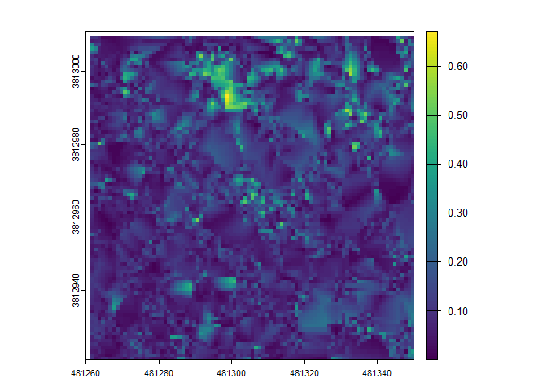

There is a canopy height model (CHM) raster which we can plot using
`terra::plot()`

``` r
# there's a CHM
cloud2trees_ans$chm_rast %>% terra::plot()
```


A spatial data frame with tree crown polygons is returned.

``` r
# there are tree crowns
cloud2trees_ans$crowns_sf %>% dplyr::glimpse()
#> Rows: 362
#> Columns: 27
#> $ treeID                    <chr> "1_481281.4_3813010.9", "2_481294.4_3813010.…
#> $ tree_height_m             <dbl> 22.23, 15.85, 12.52, 10.06, 13.44, 22.07, 22…
#> $ tree_x                    <dbl> 481281.4, 481294.4, 481296.9, 481306.4, 4813…
#> $ tree_y                    <dbl> 3813011, 3813011, 3813011, 3813011, 3813011,…
#> $ crown_area_m2             <dbl> 10.3750, 5.5000, 2.6250, 1.1250, 4.6250, 6.3…
#> $ geometry                  <GEOMETRY [m]> MULTIPOLYGON (((481280.5 38..., POL…
#> $ fia_est_dbh_cm            <dbl> NA, NA, NA, NA, NA, NA, NA, NA, NA, NA, NA, …
#> $ fia_est_dbh_cm_lower      <dbl> NA, NA, NA, NA, NA, NA, NA, NA, NA, NA, NA, …
#> $ fia_est_dbh_cm_upper      <dbl> NA, NA, NA, NA, NA, NA, NA, NA, NA, NA, NA, …
#> $ dbh_cm                    <dbl> NA, NA, NA, NA, NA, NA, NA, NA, NA, NA, NA, …
#> $ is_training_data          <lgl> NA, NA, NA, NA, NA, NA, NA, NA, NA, NA, NA, …
#> $ dbh_m                     <dbl> NA, NA, NA, NA, NA, NA, NA, NA, NA, NA, NA, …
#> $ radius_m                  <dbl> NA, NA, NA, NA, NA, NA, NA, NA, NA, NA, NA, …
#> $ basal_area_m2             <dbl> NA, NA, NA, NA, NA, NA, NA, NA, NA, NA, NA, …
#> $ basal_area_ft2            <dbl> NA, NA, NA, NA, NA, NA, NA, NA, NA, NA, NA, …
#> $ ptcld_extracted_dbh_cm    <dbl> NA, NA, NA, NA, NA, NA, NA, NA, NA, NA, NA, …
#> $ ptcld_predicted_dbh_cm    <dbl> NA, NA, NA, NA, NA, NA, NA, NA, NA, NA, NA, …
#> $ tree_cbh_m                <dbl> NA, NA, NA, NA, NA, NA, NA, NA, NA, NA, NA, …
#> $ is_training_cbh           <lgl> NA, NA, NA, NA, NA, NA, NA, NA, NA, NA, NA, …
#> $ forest_type_group_code    <chr> NA, NA, NA, NA, NA, NA, NA, NA, NA, NA, NA, …
#> $ forest_type_group         <chr> NA, NA, NA, NA, NA, NA, NA, NA, NA, NA, NA, …
#> $ hardwood_softwood         <chr> NA, NA, NA, NA, NA, NA, NA, NA, NA, NA, NA, …
#> $ comp_trees_per_ha         <dbl> NA, NA, NA, NA, NA, NA, NA, NA, NA, NA, NA, …
#> $ comp_relative_tree_height <dbl> NA, NA, NA, NA, NA, NA, NA, NA, NA, NA, NA, …
#> $ comp_dist_to_nearest_m    <dbl> NA, NA, NA, NA, NA, NA, NA, NA, NA, NA, NA, …
#> $ max_crown_diam_height_m   <dbl> NA, NA, NA, NA, NA, NA, NA, NA, NA, NA, NA, …
#> $ is_training_hmd           <lgl> NA, NA, NA, NA, NA, NA, NA, NA, NA, NA, NA, …
```

Notice that all of the `dbh`, `cbh`, `forest_type`, HMD
(`max_crown_diam_height_m`), and competition (`comp_`) columns do not
have data. To estimate these values, we need to explicitly tell the
`cloud2trees()` to perform the processing required by setting the
parameters:

- `estimate_tree_dbh=TRUE` for DBH (see also `trees_dbh()`)
- `estimate_tree_cbh=TRUE` for CBH (see also `trees_cbh()`)
- `estimate_tree_type=TRUE` for forest type (see also `trees_type()`)
- `estimate_tree_hmd=TRUE` for tree HMD (see also `trees_hmd()`)
- `estimate_tree_competition=TRUE` for competition (see also
  `trees_competition()`)

Let’s plot these tree crown polygons using `ggplot2::ggplot()` with some
custom plot settings.

``` r
cloud2trees_ans$crowns_sf %>% 
  ggplot2::ggplot(mapping = ggplot2::aes(fill = tree_height_m)) + 
  ggplot2::geom_sf() + 
  ggplot2::scale_fill_distiller(palette = "Oranges", name = "tree ht. (m)", direction = 1) +
  ggplot2::theme_void() +
  ggplot2::theme(legend.position = "top", legend.direction = "horizontal")
```


A spatial data frame with tree top points is returned.

``` r
# there are tree top points
cloud2trees_ans$treetops_sf %>% dplyr::glimpse()
#> Rows: 362
#> Columns: 25
#> $ treeID                    <chr> "1_481281.4_3813010.9", "2_481294.4_3813010.…
#> $ tree_height_m             <dbl> 22.23, 15.85, 12.52, 10.06, 13.44, 22.07, 22…
#> $ crown_area_m2             <dbl> 10.3750, 5.5000, 2.6250, 1.1250, 4.6250, 6.3…
#> $ fia_est_dbh_cm            <dbl> NA, NA, NA, NA, NA, NA, NA, NA, NA, NA, NA, …
#> $ fia_est_dbh_cm_lower      <dbl> NA, NA, NA, NA, NA, NA, NA, NA, NA, NA, NA, …
#> $ fia_est_dbh_cm_upper      <dbl> NA, NA, NA, NA, NA, NA, NA, NA, NA, NA, NA, …
#> $ dbh_cm                    <dbl> NA, NA, NA, NA, NA, NA, NA, NA, NA, NA, NA, …
#> $ is_training_data          <lgl> NA, NA, NA, NA, NA, NA, NA, NA, NA, NA, NA, …
#> $ dbh_m                     <dbl> NA, NA, NA, NA, NA, NA, NA, NA, NA, NA, NA, …
#> $ radius_m                  <dbl> NA, NA, NA, NA, NA, NA, NA, NA, NA, NA, NA, …
#> $ basal_area_m2             <dbl> NA, NA, NA, NA, NA, NA, NA, NA, NA, NA, NA, …
#> $ basal_area_ft2            <dbl> NA, NA, NA, NA, NA, NA, NA, NA, NA, NA, NA, …
#> $ ptcld_extracted_dbh_cm    <dbl> NA, NA, NA, NA, NA, NA, NA, NA, NA, NA, NA, …
#> $ ptcld_predicted_dbh_cm    <dbl> NA, NA, NA, NA, NA, NA, NA, NA, NA, NA, NA, …
#> $ tree_cbh_m                <dbl> NA, NA, NA, NA, NA, NA, NA, NA, NA, NA, NA, …
#> $ is_training_cbh           <lgl> NA, NA, NA, NA, NA, NA, NA, NA, NA, NA, NA, …
#> $ forest_type_group_code    <chr> NA, NA, NA, NA, NA, NA, NA, NA, NA, NA, NA, …
#> $ forest_type_group         <chr> NA, NA, NA, NA, NA, NA, NA, NA, NA, NA, NA, …
#> $ hardwood_softwood         <chr> NA, NA, NA, NA, NA, NA, NA, NA, NA, NA, NA, …
#> $ comp_trees_per_ha         <dbl> NA, NA, NA, NA, NA, NA, NA, NA, NA, NA, NA, …
#> $ comp_relative_tree_height <dbl> NA, NA, NA, NA, NA, NA, NA, NA, NA, NA, NA, …
#> $ comp_dist_to_nearest_m    <dbl> NA, NA, NA, NA, NA, NA, NA, NA, NA, NA, NA, …
#> $ max_crown_diam_height_m   <dbl> NA, NA, NA, NA, NA, NA, NA, NA, NA, NA, NA, …
#> $ is_training_hmd           <lgl> NA, NA, NA, NA, NA, NA, NA, NA, NA, NA, NA, …
#> $ geometry                  <POINT [m]> POINT (481281.4 3813011), POINT (48129…
```

Notice that `cloud2trees_ans$crowns_sf` and
`cloud2trees_ans$treetops_sf` have the *exact same structure* but one is
spatial polygons and the other is spatial points.

Let’s plot these tree top points using `ggplot2::ggplot()` with some
custom plot settings.

``` r
cloud2trees_ans$treetops_sf %>% 
  ggplot2::ggplot(mapping = ggplot2::aes(color = tree_height_m)) + 
  ggplot2::geom_sf() + 
  ggplot2::scale_color_distiller(palette = "Oranges", name = "tree ht. (m)", direction = 1) +
  ggplot2::theme_void() +
  ggplot2::theme(legend.position = "top", legend.direction = "horizontal")
```


It is also the case that the points in `cloud2trees_ans$treetops_sf`
will match to exactly one crown polygon in `cloud2trees_ans$crowns_sf`.

``` r
ggplot2::ggplot() + 
  ggplot2::geom_sf(data = cloud2trees_ans$crowns_sf, mapping = ggplot2::aes(fill = tree_height_m)) + 
  ggplot2::geom_sf(data = cloud2trees_ans$treetops_sf, shape = 20) + 
  ggplot2::scale_fill_distiller(palette = "Oranges", name = "tree ht. (m)", direction = 1) +
  ggplot2::theme_void() +
  ggplot2::theme(legend.position = "top", legend.direction = "horizontal")
```


# Individual Tree Detection (ITD) Tuning

The `cloud2trees` package performs individual tree detection using
`lidR::locate_trees()` with the `lidR::lmf()` algorithm. The local
maximum filter algorithm allows for a constant window size or a variable
window size defined by a function. See the `lidR` [package book
section](https://r-lidar.github.io/lidRbook/itd.html) by point cloud
processing expert, [Jean-Romain
Roussel](https://github.com/Jean-Romain), for excellent detail on ITD
and defining window size.

The `itd_tuning()` function is used to visually assess tree crown
delineation results from different window size functions used for the
detection of individual trees. `itd_tuning()` allows users to test
different window size functions on a sample of data to determine which
function is most suitable for the area being analyzed. The preferred
function can then be used in the `ws` parameter in `raster2trees()` and
`cloud2trees()`.

## Default ITD window size functions

We’ll continue to use the `MixedConifer.laz` that ships with the `lidR`
package for our example. `itd_tuning()` enables users to sample from up
to five 0.1 ha plots (`n_samples` parameter) that are randomly selected
from within the bounding box of the point cloud data coverage. A
function or a named list of functions can be tested using the
`ws_fn_list` parameter which can also be left at the default value
(`NULL`) to test default exponential, linear, and non-linear functions.
We’ll run `itd_tuning()` with all default options to start.

``` r
itd_tuning_ans <- itd_tuning(input_las_dir = i)
```

Let’s check out what is included in the return from the `itd_tuning()`
function.

``` r
# what is it?
itd_tuning_ans %>% names()
#> [1] "plot_samples" "ws_fn_list"
```

there is a plot of the different window size functions tested (plot
columns) over the different 0.1 ha sample plots (plot rows) and the
number of individual trees extracted shown outlined in gray overlaid on
the canopy height model (CHM).

``` r
itd_tuning_ans$plot_samples
```


if we think that the “exp_fn” was the most appropriate for our area, we
can access the function from the returned list of window size functions
and store it for use in `raster2trees()` and `cloud2trees()`

``` r
# get the best function
best_ws <- itd_tuning_ans$ws_fn_list$exp_fn
```

we can plot what the function looks like

``` r
ggplot2::ggplot() +
  ggplot2::geom_function(fun = best_ws, color = "brown", lwd = 1) +
  ggplot2::xlim(-5,60) +
  ggplot2::labs(x = "heights", y = "ws", color = "") +
  ggplot2::theme_light()
```


## Custom ITD window size functions

Let’s work through how to test some custom window size functions. We’ll
test a constant window size of 3 m and a custom function where the
windows size is linearly related to the point height

``` r
# a constant window size has to be defined as:
 ## x*0 + constant
 my_constant <- function(x){(x * 0) + 3} ## will always return 3
# a custom linear function
 my_linear <- function(x) {(x * 0.1) + 3}
# let's put these in a list to test with the best default function we saved from above
  my_fn_list <- list(
    my_constant = my_constant
    , my_linear = my_linear
    , best_default_ws = best_ws
  )
```

run `itd_tuning()` with our custom window size definitions and this time
we’ll only try on two sample plots of 0.1 ha

``` r
# run it with custom functions
itd_tuning_ans2 <- itd_tuning(
 input_las_dir = i
 , ws_fn_list = my_fn_list
 , n_samples = 2
)
```

let’s check out that tuning plot

``` r
# look at the tuning plot
itd_tuning_ans2$plot_samples
```

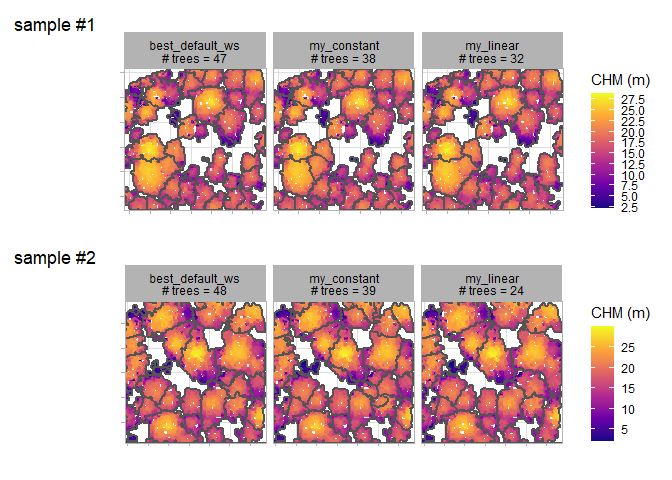

we can also check out what our custom “my_linear” function looks like

``` r
ggplot2::ggplot() +
  ggplot2::geom_function(
    fun = itd_tuning_ans2$ws_fn_list$my_linear
    , color = "gold"
    , lwd = 1
  ) +
  ggplot2::xlim(-5,60) +
  ggplot2::ylim(-0.5,NA) +
  ggplot2::labs(x = "heights", y = "ws", color = "") +
  ggplot2::theme_light()
```


# Extract Trees from Point Cloud: Custom

We’ll continue to use the `MixedConifer.laz` that ships with the `lidR`
package for our example.

Customizing the `cloud2trees()` function parameters we’ll:

- Change the resolution of the DTM using `dtm_res_m`
- Change moving window used to detect the local maxima tree tops using
  `ws` with our best window size from our `itd_tuning()` exploration
  above
- Estimate tree DBH using allometry from FIA plot data with
  `estimate_tree_dbh`
- Extract tree FIA Forest Type Group with `estimate_tree_type`
- Quantify tree competition metrics with `estimate_tree_competition`
- Extract tree CBH from the point cloud with `estimate_tree_cbh` for a
  sample of 555 trees using `cbh_tree_sample_n`
- Model the remaining tree CBH values with `cbh_estimate_missing_cbh`
  based on our sample of 555 trees

``` r
# run it
cloud2trees_ans_c <- cloud2trees::cloud2trees(
  output_dir = tempdir()
  , input_las_dir = i
  , dtm_res_m = 0.5
  , ws = best_ws
  , estimate_tree_dbh = TRUE
  , estimate_tree_type = TRUE
  , estimate_tree_competition = TRUE
  , estimate_tree_cbh = TRUE
  , cbh_tree_sample_n = 555
  , cbh_estimate_missing_cbh = TRUE
)
```

Check how the digital terrain model (DTM) raster has changed

``` r
paste(
  "Default DTM resolution:"
  , cloud2trees_ans$dtm_rast %>% terra::res() %>% paste(collapse = ",")
  , "|| Custom DTM resolution:"
  , cloud2trees_ans_c$dtm_rast %>% terra::res() %>% paste(collapse = ",")
)
#> [1] "Default DTM resolution: 1,1 || Custom DTM resolution: 0.5,0.5"
```

Check that our spatial data frame with tree crown polygons has data in
the `dbh`, `cbh`, `forest_type`, and `comp` (i.e. competition) columns.

``` r
cloud2trees_ans_c$crowns_sf %>% dplyr::glimpse()
#> Rows: 340
#> Columns: 27
#> $ treeID                    <chr> "1_481294.4_3813010.9", "2_481312.9_3813010.…
#> $ tree_height_m             <dbl> 15.85, 13.44, 22.07, 22.93, 24.43, 22.23, 11…
#> $ tree_x                    <dbl> 481294.4, 481312.9, 481325.1, 481335.9, 4812…
#> $ tree_y                    <dbl> 3813011, 3813011, 3813011, 3813011, 3813011,…
#> $ crown_area_m2             <dbl> 10.8750, 6.5000, 6.3750, 27.0625, 10.1250, 1…
#> $ geometry                  <GEOMETRY [m]> POLYGON ((481292.5 3813011,..., POL…
#> $ fia_est_dbh_cm            <dbl> 32.484899, 25.563249, 50.434351, 53.525211, …
#> $ fia_est_dbh_cm_lower      <dbl> 15.597322, 12.038640, 23.623898, 24.533774, …
#> $ fia_est_dbh_cm_upper      <dbl> 54.300665, 42.801257, 84.940986, 90.141837, …
#> $ dbh_cm                    <dbl> 32.484899, 25.563249, 50.434351, 53.525211, …
#> $ is_training_data          <lgl> FALSE, FALSE, FALSE, FALSE, FALSE, FALSE, FA…
#> $ dbh_m                     <dbl> 0.32484899, 0.25563249, 0.50434351, 0.535252…
#> $ radius_m                  <dbl> 0.16242450, 0.12781625, 0.25217176, 0.267626…
#> $ basal_area_m2             <dbl> 0.082880609, 0.051324177, 0.199775744, 0.225…
#> $ basal_area_ft2            <dbl> 0.89212688, 0.55245345, 2.15038611, 2.422034…
#> $ ptcld_extracted_dbh_cm    <dbl> NA, NA, NA, NA, NA, NA, NA, NA, NA, NA, NA, …
#> $ ptcld_predicted_dbh_cm    <dbl> NA, NA, NA, NA, NA, NA, NA, NA, NA, NA, NA, …
#> $ tree_cbh_m                <dbl> 8.500000, 9.500000, 20.500000, 14.500000, 16…
#> $ is_training_cbh           <lgl> TRUE, TRUE, TRUE, TRUE, TRUE, TRUE, TRUE, TR…
#> $ forest_type_group_code    <chr> "220", "220", "220", "220", "220", "220", "2…
#> $ forest_type_group         <chr> "Ponderosa pine group", "Ponderosa pine grou…
#> $ hardwood_softwood         <chr> "Softwood", "Softwood", "Softwood", "Softwoo…
#> $ comp_trees_per_ha         <dbl> 495.0296, 1485.0889, 742.5445, 247.5148, 699…
#> $ comp_relative_tree_height <dbl> 1.00000000, 1.00000000, 0.85708737, 1.000000…
#> $ comp_dist_to_nearest_m    <dbl> 2.8504386, 2.2638463, 3.6055513, 5.3967583, …
#> $ max_crown_diam_height_m   <dbl> NA, NA, NA, NA, NA, NA, NA, NA, NA, NA, NA, …
#> $ is_training_hmd           <lgl> NA, NA, NA, NA, NA, NA, NA, NA, NA, NA, NA, …
```

Remember, we also changed the `ws` parameter used to detect the local
maxima for identifying tree tops so we got a few less trees compared to
the default settings.

``` r
paste(
  "Default trees extracted:"
  , cloud2trees_ans$crowns_sf %>% nrow()
  , "|| Custom trees extracted:"
  , cloud2trees_ans_c$crowns_sf %>% nrow()
)
#> [1] "Default trees extracted: 362 || Custom trees extracted: 340"
```

Let’s look at the relationship between tree height and tree DBH
estimated from the FIA plot data.

``` r
cloud2trees_ans_c$crowns_sf %>%
  ggplot2::ggplot(mapping = ggplot2::aes(x = tree_height_m, y = dbh_cm)) + 
  ggplot2::geom_point(color = "navy", alpha = 0.6) +
  ggplot2::labs(x = "tree ht. (m)", y = "tree DBH (cm)") +
  ggplot2::scale_x_continuous(limits = c(0,NA)) +
  ggplot2::scale_y_continuous(limits = c(0,NA)) +
  ggplot2::theme_light()
```


Let’s look at the relationship between tree height and tree CBH as
extracted from the point cloud. Note, that we do not expect a perfect
linear relationship between tree height and CBH throughout the entire
height range because CBH is also determined spatially (e.g. as a fire
moves through a stand).

``` r
cloud2trees_ans_c$crowns_sf %>%
  dplyr::arrange(is_training_cbh) %>%
  ggplot2::ggplot(mapping = ggplot2::aes(x = tree_height_m, y = tree_cbh_m, color=is_training_cbh)) + 
  ggplot2::geom_point() +
  ggplot2::labs(x = "tree ht. (m)", y = "tree CBH (m)") +
  ggplot2::scale_y_continuous(breaks = scales::extended_breaks(n=12)) +
  ggplot2::scale_x_continuous(breaks = scales::extended_breaks(n=14)) +
  ggplot2::scale_color_viridis_d(alpha = 0.8, name = "is CBH\nfrom cloud?") +
  ggplot2::theme_light()
```


We can also plot height, diameter, and CBH of trees spatially and we’ll
use the `patchwork` package to combine our plots.

``` r
library(patchwork)
# height plot
plt_ht <-
  cloud2trees_ans_c$crowns_sf %>% 
  ggplot2::ggplot(mapping = ggplot2::aes(fill = tree_height_m)) + 
  ggplot2::geom_sf() + 
  ggplot2::scale_fill_distiller(palette = "Oranges", name = "tree ht. (m)", direction = 1) +
  ggplot2::theme_void() +
  ggplot2::theme(legend.position = "top", legend.direction = "horizontal")
# diameter plot
plt_dbh <-
  cloud2trees_ans_c$crowns_sf %>% 
  ggplot2::ggplot(mapping = ggplot2::aes(fill = dbh_cm)) + 
  ggplot2::geom_sf() + 
  ggplot2::scale_fill_distiller(palette = "Purples", name = "tree DBH (cm)", direction = 1) +
  ggplot2::theme_void() +
  ggplot2::theme(legend.position = "top", legend.direction = "horizontal")
# CBH plot
plt_cbh <-
  cloud2trees_ans_c$crowns_sf %>% 
  ggplot2::ggplot(mapping = ggplot2::aes(fill = tree_cbh_m)) + 
  ggplot2::geom_sf() + 
  ggplot2::scale_fill_distiller(palette = "Greens", name = "tree CBH (m)", direction = 1) +
  ggplot2::theme_void() +
  ggplot2::theme(legend.position = "top", legend.direction = "horizontal")
# combine with patchwork
plt_ht + plt_dbh + plt_cbh + patchwork::plot_layout(ncol = 2) &
  ggplot2::theme(
    legend.title = ggplot2::element_text(size = 8)
    , legend.text = ggplot2::element_text(size = 7)
  )
```


Let’s plot the distance to the nearest tree that we obtained by turning
on the `estimate_tree_competition` parameter in the `cloud2trees()`
function call to quantify tree competition metrics. We’ll use the
spatial tree points data in `cloud2trees_ans_c$treetops_sf`.

``` r
cloud2trees_ans_c$treetops_sf %>%
  ggplot2::ggplot(mapping = ggplot2::aes(color = comp_dist_to_nearest_m)) + 
  ggplot2::geom_sf() +
  ggplot2::scale_color_distiller(palette = "Greys", name = "distance to\nnearest tree", direction = 1) +
  ggplot2::theme_void() +
  ggplot2::theme(legend.position = "top", legend.direction = "horizontal")
```


Let’s look at the FIA Forest Type Group data we extracted for the tree
list.

``` r
cloud2trees_ans_c$treetops_sf %>%
  sf::st_drop_geometry() %>% 
  dplyr::count(forest_type_group_code, forest_type_group)
#> # A tibble: 1 × 3
#>   forest_type_group_code forest_type_group        n
#>   <chr>                  <chr>                <int>
#> 1 220                    Ponderosa pine group   340
```

# Extract Raster Data from Point Cloud

We can use the `cloud2raster()` function if we only want to create a DTM
and CHM from our point cloud data. This function also creates a
classified and height normalized point cloud in the process. If you wish
to keep these point clouds ensure to turn on the `keep_intrmdt`
parameter and see the `point_cloud_processing_temp` directory nested in
the `output_dir`.

``` r
cloud2raster_ans <- cloud2trees::cloud2raster(output_dir = tempdir(), input_las_dir = i)
```

There is a digital terrain model (DTM) raster which we can plot using
`terra::plot()`

``` r
# there's a DTM
cloud2raster_ans$dtm_rast %>% terra::plot()
```

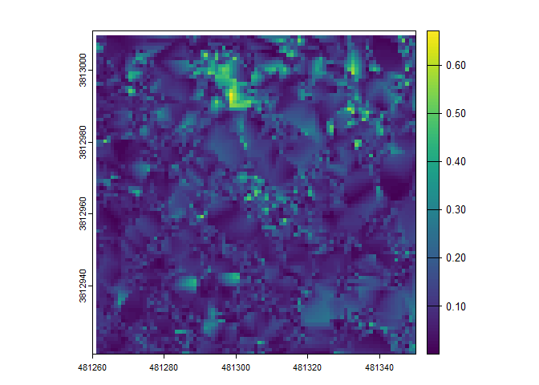

There is a canopy height model (CHM) raster which we can plot using
`terra::plot()`

``` r
# there's a CHM
cloud2raster_ans$chm_rast %>% terra::plot()
```


# Extract Trees from Raster Data

We can use the `raster2trees()` function if we already have a CHM raster
and want to extract a tree list.

We’ll use the CHM example that ships with the `cloud2trees` package.

``` r
# read example CHM raster
f <- paste0(system.file(package = "cloud2trees"),"/extdata/chm.tif")
r <- terra::rast(f)
# extract trees from raster
raster2trees_ans <- cloud2trees::raster2trees(chm_rast = r, outfolder = tempdir())
```

A spatial data frame with tree crown polygons is returned.

``` r
# there are tree crowns
raster2trees_ans %>% dplyr::glimpse()
#> Rows: 149
#> Columns: 6
#> $ treeID        <chr> "1_458054.1_4450092.9", "2_458055.9_4450092.9", "3_45806…
#> $ tree_height_m <dbl> 4.599, 5.130, 10.641, 4.610, 8.957, 10.310, 6.515, 4.271…
#> $ tree_x        <dbl> 458054.1, 458055.9, 458064.9, 458078.4, 458067.6, 458044…
#> $ tree_y        <dbl> 4450093, 4450093, 4450093, 4450093, 4450092, 4450092, 44…
#> $ crown_area_m2 <dbl> 0.5625, 0.3750, 1.8750, 1.0000, 3.2500, 5.0000, 1.3750, …
#> $ geometry      <GEOMETRY [m]> POLYGON ((458054 4450093, 4..., POLYGON ((45805…
```

Let’s plot these tree crown polygons using `ggplot2::ggplot()` with some
custom plot settings.

``` r
raster2trees_ans %>% 
  ggplot2::ggplot(mapping = ggplot2::aes(fill = tree_height_m)) + 
  ggplot2::geom_sf() + 
  ggplot2::scale_fill_distiller(palette = "Oranges", name = "tree ht. (m)", direction = 1) +
  ggplot2::theme_void() +
  ggplot2::theme(legend.position = "top", legend.direction = "horizontal")
```

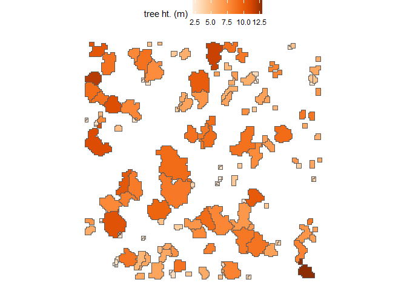

# Estimate Tree DBH for a Tree List

If we already have a list of trees with tree coordinate and tree height
data, we can estimate tree DBH using a site-specific allometric equation
based on FIA data with the `trees_dbh()` function.

We just need to pass a data frame with the columns `treeID`, `tree_x`,
`tree_y`, and `tree_height_m` to the `trees_dbh()` function.

``` r
# a fake tree list
tl <- dplyr::tibble(
    treeID = c(1:21)
    , tree_x = rnorm(n=21, mean = 458064, sd = 11)
    , tree_y = rnorm(n=21, mean = 4450074, sd = 11)
    , tree_height_m = exp(rgamma(n = 21, shape = (7/4)^2, rate = (4^2)/7))
  )
```

Use the `trees_dbh()` function to estimate DBH based on tree height and
tree location.

``` r
# call the function
tl_dbh <- cloud2trees::trees_dbh(tree_list = tl, crs = "32613")
```

What is this data?

``` r
tl_dbh %>% dplyr::glimpse()
#> Rows: 21
#> Columns: 16
#> $ treeID                 <chr> "1", "2", "3", "4", "5", "6", "7", "8", "9", "1…
#> $ tree_x                 <dbl> 458059.6, 458059.9, 458073.1, 458077.1, 458064.…
#> $ tree_y                 <dbl> 4450085, 4450077, 4450097, 4450073, 4450094, 44…
#> $ tree_height_m          <dbl> 1.809877, 1.860768, 2.964875, 14.734289, 3.3574…
#> $ geometry               <POINT [m]> POINT (458059.6 4450085), POINT (458059.9…
#> $ fia_est_dbh_cm         <dbl> 3.376705, 3.520496, 4.912248, 28.919887, 5.4821…
#> $ fia_est_dbh_cm_lower   <dbl> 1.493278, 1.545043, 2.124471, 12.669732, 2.4246…
#> $ fia_est_dbh_cm_upper   <dbl> 5.875407, 6.074221, 8.556860, 51.291307, 9.5428…
#> $ dbh_cm                 <dbl> 3.376705, 3.520496, 4.912248, 28.919887, 5.4821…
#> $ is_training_data       <lgl> FALSE, FALSE, FALSE, FALSE, FALSE, FALSE, FALSE…
#> $ dbh_m                  <dbl> 0.03376705, 0.03520496, 0.04912248, 0.28919887,…
#> $ radius_m               <dbl> 0.01688352, 0.01760248, 0.02456124, 0.14459944,…
#> $ basal_area_m2          <dbl> 0.0008955216, 0.0009734142, 0.0018951801, 0.065…
#> $ basal_area_ft2         <dbl> 0.009639394, 0.010477830, 0.020399719, 0.707060…
#> $ ptcld_extracted_dbh_cm <dbl> NA, NA, NA, NA, NA, NA, NA, NA, NA, NA, NA, NA,…
#> $ ptcld_predicted_dbh_cm <dbl> NA, NA, NA, NA, NA, NA, NA, NA, NA, NA, NA, NA,…
```

Let’s look at the relationship between tree height and tree DBH
estimated from the FIA plot data.

``` r
tl_dbh %>%
  ggplot2::ggplot(mapping = ggplot2::aes(x = tree_height_m, y = dbh_cm)) + 
  ggplot2::geom_point(color = "navy", alpha = 0.6) +
  ggplot2::labs(x = "tree ht. (m)", y = "tree DBH (cm)") +
  ggplot2::scale_x_continuous(limits = c(0,NA)) +
  ggplot2::scale_y_continuous(limits = c(0,NA)) +
  ggplot2::theme_light()
```


We can look at this data spatially too.

``` r
# height plot
plt_ht2 <-
  tl_dbh %>% 
  ggplot2::ggplot(mapping = ggplot2::aes(color = tree_height_m)) + 
  ggplot2::geom_sf(size = 3) + 
  ggplot2::scale_color_distiller(palette = "Oranges", name = "tree ht. (m)", direction = 1) +
  ggplot2::theme_void() +
  ggplot2::theme(
    legend.position = "top", legend.direction = "horizontal"
    , panel.border = ggplot2::element_rect(color = "black", fill = NA)
  )
# diameter plot
plt_dbh2 <-
  tl_dbh %>% 
  ggplot2::ggplot(mapping = ggplot2::aes(color = dbh_cm)) + 
  ggplot2::geom_sf(size = 3) + 
  ggplot2::scale_color_distiller(palette = "Purples", name = "tree DBH (cm)", direction = 1) +
  ggplot2::theme_void() +
  ggplot2::theme(
    legend.position = "top", legend.direction = "horizontal"
    , panel.border = ggplot2::element_rect(color = "black", fill = NA)
  )
# combine with patchwork
plt_ht2 + plt_dbh2
```


# Estimate Tree Forest Type for a Tree List

If we already have a list of trees with tree coordinate, we can use the
`trees_type()` function attach the tree forest type based on the spatial
overlap with the [Forest Type Groups of the Continental United
States](https://www.arcgis.com/home/item.html?id=10760c83b9e44923bd3c18efdaa7319d)
data (Wilson 2023). This forest type group layer was developed using
data from over 213,000 national forest inventory plots measured during
the period 2014-2018 from the FIA program at 30-meter resolution
covering the forested extent of the continental US.

We just need to pass a data frame with the columns `treeID`, `tree_x`,
`tree_y` to the `trees_type()` function. We can also use an `sf` class
object with POINT or POLYGON geometry (see `sf::st_geometry_type()`) and
the program will use the data “as-is” and only require the `treeID`
column.

``` r
# a fake tree list
tl <- dplyr::tibble(
    treeID = c(1:66)
    , tree_x = rnorm(n=66, mean = 458000, sd = 75)
    , tree_y = rnorm(n=66, mean = 4450000, sd = 75)
  )
```

Use the `trees_type()` function to extract the FIA forest type group
based on tree location. If a tree overlaps with an area that is
classified as “non-forest”, the program will search for the nearest
forest type to impute a value; we’ll limit the search radius by setting
the `max_search_dist_m` parameter to 88 meters.

``` r
# call the function
tl_type <- cloud2trees::trees_type(tree_list = tl, crs = "32613", max_search_dist_m = 88)
```

The return includes our tree list with forest type data (`tree_list`) as
well as the FIA Forest Types Group raster (`foresttype_rast`) of the
area we searched.

``` r
tl_type %>% names()
#> [1] "tree_list"       "foresttype_rast"
```

What is in the tree list data?

``` r
tl_type$tree_list %>% dplyr::glimpse()
#> Rows: 66
#> Columns: 7
#> $ treeID                 <chr> "1", "2", "3", "4", "5", "6", "7", "8", "9", "1…
#> $ tree_x                 <dbl> 457912.8, 457937.8, 457903.0, 457971.9, 457892.…
#> $ tree_y                 <dbl> 4449984, 4450028, 4450084, 4449982, 4449998, 44…
#> $ geometry               <POINT [m]> POINT (457912.8 4449984), POINT (457937.8…
#> $ forest_type_group_code <chr> "200", "200", "200", "200", "200", "200", "280"…
#> $ forest_type_group      <chr> "Douglas-fir group", "Douglas-fir group", "Doug…
#> $ hardwood_softwood      <chr> "Softwood", "Softwood", "Softwood", "Softwood",…
```

Let’s look at the FIA Forest Type Group data we extracted for the tree
list.

``` r
tl_type$tree_list %>%
  sf::st_drop_geometry() %>% 
  dplyr::count(forest_type_group_code, forest_type_group)
#> # A tibble: 4 × 3
#>   forest_type_group_code forest_type_group                         n
#>   <chr>                  <chr>                                 <int>
#> 1 200                    Douglas-fir group                        42
#> 2 220                    Ponderosa pine group                      3
#> 3 260                    Fir / spruce / mountain hemlock group     2
#> 4 280                    Lodgepole pine group                     19
```

We can plot our spatial tree list

``` r
# now plot
tl_type$tree_list %>%
  ggplot2::ggplot() + 
  ggplot2::geom_sf(ggplot2::aes(color=forest_type_group), size = 3) +
  ggplot2::labs(color = "FIA forest\ntype group") +
  ggplot2::scale_color_brewer(palette = "Dark2") +
  ggplot2::theme_void() +
  ggplot2::theme(panel.border = ggplot2::element_rect(color = "black", fill = NA))
```

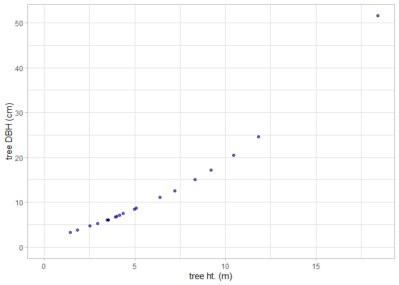

Let’s check out the FIA Forest Types Group raster (`foresttype_rast`) of
the area we searched

``` r
r_plt <- 
  tl_type$foresttype_rast %>%
    as.data.frame(xy=T) %>% 
    dplyr::rename(f = 3) %>% 
    dplyr::mutate(f = as.factor(f)) %>% 
    ggplot2::ggplot() + 
    ggplot2::geom_tile(mapping = ggplot2::aes(x=x, y=y, fill = f)) +
    ggplot2::labs(fill = "FIA forest type\ngroup code") +
    ggplot2::scale_fill_viridis_d(option = "turbo", alpha = 0.9) +
    ggplot2::theme_void()
r_plt
```


See the [Forest Type Groups of the Continental United
States](https://www.arcgis.com/home/item.html?id=10760c83b9e44923bd3c18efdaa7319d)
data (Wilson 2023) for a list of possible forest type group codes

Let’s overlay our tree points on the raster data

``` r
r_plt +
  ggplot2::geom_sf(
    data = tl_type$tree_list %>%  
      # we have to reproject
      sf::st_transform(
        crs = tl_type$foresttype_rast %>%
          terra::crs(describe=T) %>%
          dplyr::pull(code) %>%
          as.numeric() %>%
          sf::st_crs()
      )
    , mapping = ggplot2::aes(shape = forest_type_group)
    , color = "white"
    , size = 2
  ) +
  ggplot2::labs(shape = "FIA forest\ntype group") +
  ggplot2::guides(shape = ggplot2::guide_legend(override.aes = list(size = 3, color = "black")))
```

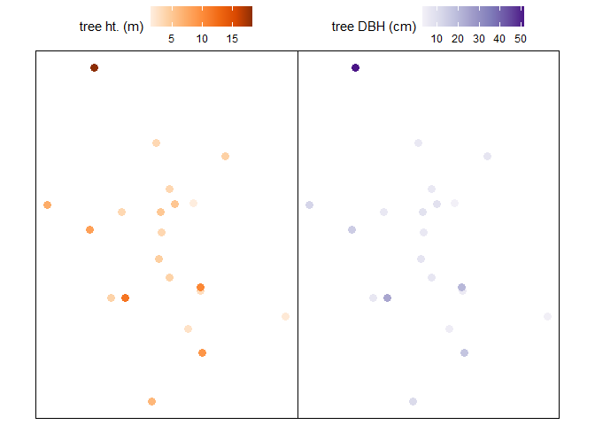

# Estimate Tree CBH for a Tree List

If you wish to estimate crown base height (CBH) as part of the point
cloud processing the `LadderFuelsR` package
(<https://github.com/olgaviedma/LadderFuelsR>) and `leafR` package
(<https://github.com/DRAAlmeida/leafR>) must be manually installed
first.

``` r
# install.packages("remotes")
## install LadderFuelsR
remotes::install_github(repo = "olgaviedma/LadderFuelsR", upgrade = F)
## install leafR
remotes::install_github(repo = "DRAAlmeida/leafR", upgrade = F)
```

After installing these packages, if we already have spatial polygons of
tree crowns and height normalized point cloud data, we can attempt to
extract tree CBH from the point cloud using the `trees_cbh()` function.

We just need to pass a `sf` class object with POLYGON geometry and the
columns `treeID` and `tree_height_m` and the height normalized point
cloud data to the `trees_cbh()` function.

We’ll use the tree crown polygons and normalized point cloud data
examples that ship with the `cloud2trees` package. We will turn on the
`force_same_crs` parameter to force the same projection between the
point cloud and polygon since we are confident that data were generated
with the same projection. Data generated by a `cloud2trees` pipeline
(e.g. `cloud2raster()`) will always have the same projection.

``` r
# read example crown polygons
f <- system.file(package = "cloud2trees","extdata", "crowns_poly.gpkg")
p <- sf::st_read(f, quiet = T)
# path to the normalized point cloud data
nlas <- system.file(package = "cloud2trees","extdata","norm_las")
# call the function
trees_cbh_ans <- cloud2trees::trees_cbh(
  trees_poly = p
  , norm_las = nlas
  , tree_sample_prop = 0.77
  , estimate_missing_cbh = TRUE
)
```

What is this data?

``` r
trees_cbh_ans %>% 
  dplyr::select(treeID, tree_height_m, tree_cbh_m, is_training_cbh) %>% 
  dplyr::glimpse()
#> Rows: 196
#> Columns: 5
#> $ treeID          <chr> "1_458054.1_4450092.9", "2_458055.9_4450092.9", "3_458…
#> $ tree_height_m   <dbl> 4.599, 5.130, 10.641, 4.610, 4.599, 8.957, 10.310, 4.6…
#> $ tree_cbh_m      <dbl> 4.049915, 4.500000, 8.500000, 4.059602, 4.500000, 3.50…
#> $ is_training_cbh <lgl> FALSE, TRUE, TRUE, FALSE, TRUE, TRUE, FALSE, FALSE, FA…
#> $ geom            <MULTIPOLYGON [m]> MULTIPOLYGON (((458054 4450..., MULTIPOLY…
```

Let’s look at the relationship between tree height and tree CBH as
extracted from the point cloud. Note, that we do not expect a perfect
linear relationship between tree height and CBH throughout the entire
height range because CBH is also determined spatially (e.g. as a fire
moves through a stand).

``` r
trees_cbh_ans %>%
  dplyr::arrange(is_training_cbh) %>%
  ggplot2::ggplot(mapping = ggplot2::aes(x = tree_height_m, y = tree_cbh_m, color=is_training_cbh)) + 
  ggplot2::geom_point() +
  ggplot2::labs(x = "tree ht. (m)", y = "tree CBH (m)") +
  ggplot2::scale_y_continuous(breaks = scales::extended_breaks(n=12)) +
  ggplot2::scale_x_continuous(breaks = scales::extended_breaks(n=14)) +
  ggplot2::scale_color_viridis_d(alpha = 0.8, name = "is CBH\nfrom cloud?") +
  ggplot2::theme_light()
```

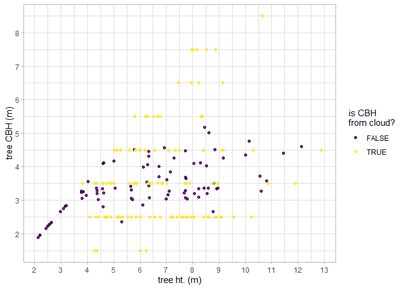

We can look at this data spatially too.

``` r
trees_cbh_ans %>%
  dplyr::arrange(is_training_cbh) %>%
  ggplot2::ggplot(mapping = ggplot2::aes(fill = tree_cbh_m, color=is_training_cbh)) + 
  ggplot2::geom_sf() +
  ggplot2::scale_color_viridis_d(alpha = 0.8, name = "is CBH\nfrom cloud?") +
  ggplot2::scale_fill_distiller(palette = "Greens", name = "tree CBH (m)", direction = 1) +
  ggplot2::theme_void() +
  ggplot2::theme(
    legend.position = "top", legend.direction = "horizontal"
    , panel.border = ggplot2::element_rect(color = "black", fill = NA)
  ) +
  ggplot2::guides(
    color = ggplot2::guide_legend(override.aes = list(lwd = 3, fill = NA))
  )
```

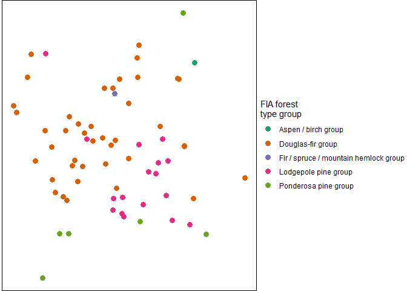

# Estimate Tree HMD for a Tree List

If you wish to extract the height of the maximum crown diameter (HMD)
using height normalized point cloud data (e.g. as exported by
`cloud2raster()`) the `trees_hmd()` function and the `estimate_tree_hmd`
in the `cloud2trees()` function may be relevant to your interests.

We just need to pass a `sf` class object with POLYGON geometry and the
columns `treeID` and `tree_height_m` and the height normalized point
cloud data to the `trees_hmd()` function. The function returns the data
with the added columns: `max_crown_diam_height_m`, `is_training_hmd`.

We’ll use the tree crown polygons and normalized point cloud data
examples that ship with the `cloud2trees` package.

``` r
# read example crown polygons
f <- system.file(package = "cloud2trees","extdata", "crowns_poly.gpkg")
p <- sf::st_read(f, quiet = T)
# path to the normalized point cloud data
nlas <- paste0(system.file(package = "cloud2trees"),"/extdata/norm_las")
# call the function
trees_hmd_ans <- cloud2trees::trees_hmd(
  trees_poly = p
  , norm_las = nlas
  , estimate_missing_hmd = TRUE
)
```

What is this data?

``` r
trees_hmd_ans %>% 
  dplyr::select(treeID, tree_height_m, max_crown_diam_height_m, is_training_hmd) %>% 
  dplyr::glimpse()
#> Rows: 196
#> Columns: 5
#> $ treeID                  <chr> "1_458054.1_4450092.9", "2_458055.9_4450092.9"…
#> $ tree_height_m           <dbl> 4.599, 5.130, 10.641, 4.610, 4.599, 8.957, 10.…
#> $ max_crown_diam_height_m <dbl> 3.494096, 4.681000, 8.943000, 3.151000, 3.2190…
#> $ is_training_hmd         <lgl> FALSE, TRUE, TRUE, TRUE, TRUE, TRUE, TRUE, TRU…
#> $ geom                    <MULTIPOLYGON [m]> MULTIPOLYGON (((458054 4450..., M…
```

Let’s look at the relationship between tree height and tree HMD as
extracted from the point cloud. Note, that we do not expect a perfect
linear relationship between tree height and HMD throughout the entire
height range because HMD is also determined spatially (e.g. as a fire
moves through a stand).

``` r
trees_hmd_ans %>%
  dplyr::arrange(is_training_cbh) %>%
  ggplot2::ggplot(
    mapping = ggplot2::aes(x = tree_height_m, y = max_crown_diam_height_m, color=is_training_hmd)
  ) + 
  ggplot2::geom_point() +
  ggplot2::labs(x = "tree ht. (m)", y = "tree HMD (m)") +
  ggplot2::scale_y_continuous(breaks = scales::extended_breaks(n=12)) +
  ggplot2::scale_x_continuous(breaks = scales::extended_breaks(n=14)) +
  ggplot2::scale_color_viridis_d(option = "turbo", begin = 0.2, alpha = 0.8, name = "is HMD\nfrom cloud?") +
  ggplot2::theme_light()
```

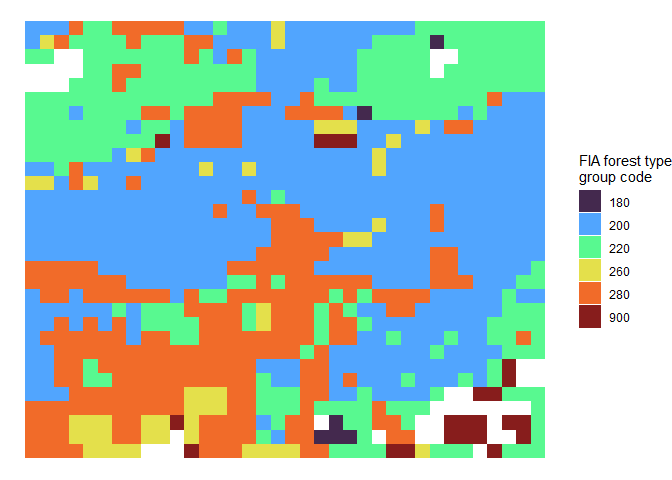

We can look at this data spatially too.

``` r
trees_hmd_ans %>%
  dplyr::arrange(is_training_hmd) %>%
  ggplot2::ggplot(mapping = ggplot2::aes(fill = max_crown_diam_height_m, color=is_training_hmd)) + 
  ggplot2::geom_sf() +
  ggplot2::scale_color_viridis_d(option = "turbo", begin = 0.2, alpha = 0.8, name = "is HMD\nfrom cloud?") +
  ggplot2::scale_fill_distiller(palette = "Greys", name = "tree HMD (m)", direction = 1) +
  ggplot2::theme_void() +
  ggplot2::theme(
    legend.position = "top", legend.direction = "horizontal"
    , panel.border = ggplot2::element_rect(color = "black", fill = NA)
  ) +
  ggplot2::guides(
    color = ggplot2::guide_legend(override.aes = list(lwd = 3, fill = NA))
  )
```

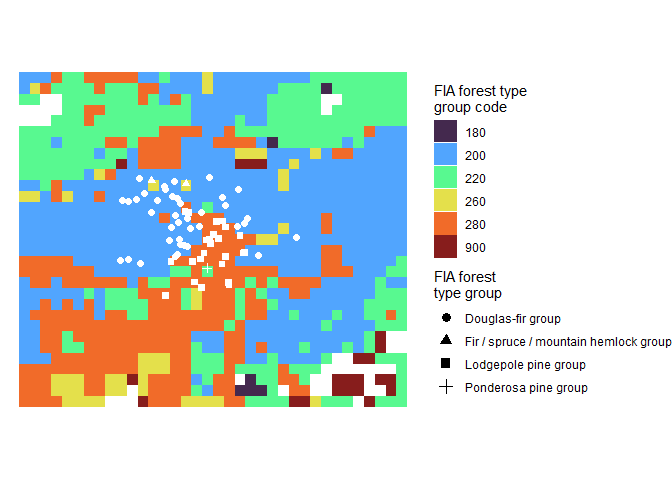

# Estimate Tree Biomass for a Tree List

The `cloud2trees()` package includes methods for estimating individual
tree biomass in kilograms, or the component biomass of the tree crown in
kilograms.

Currently supported methods for estimating biomass include:

- Tree crown biomass in kilograms:
  - “landfire” - based on [LANDFIRE’s Forest Canopy Bulk Density
    (CBD)](https://landfire.gov/fuel/cbd) data
    (`trees_biomass_landfire()`)
  - “cruz” - based on [Cruz et
    al. (2003)](https://scholar.google.com/scholar?cluster=316241498622221569&oi=gsb&hl=en&as_sdt=0,5)
    canopy fuel stratum equations (`trees_biomass_cruz()`)

The `trees_biomass()` function streamlines the process for estimating
individual tree biomass in kilograms, or the component biomass of the
tree crown in kilograms. Users can select one, some, or all of the
methods available in the package for estimating biomass.

We just need to pass a data frame with the columns `treeID`, `tree_x`,
`tree_y` to the `trees_biomass*()` function. We can also use an `sf`
class object with POINT or POLYGON geometry (see
`sf::st_geometry_type()`) and the program will use the data “as-is” and
only require the `treeID` column.

Since estimating tree crown biomass using stand-based fuel estimates
requires back-transformation to the tree level, the
`trees_biomass_landfire()`, `trees_biomass_cruz()`, and
`trees_biomass()` if using the Cruz or LANDFIRE methods also require the
following data attributes:

- `crown_area_m2`, `tree_height_m` (e.g. as exported by
  `raster2trees()`)
- `tree_cbh_m` (e.g. as exported by `trees_cbh()`)
- and one of `dbh_cm`, `dbh_m`, or `basal_area_m2` (e.g. as exported by
  `trees_dbh()`)

We’ll use the tree crown polygons that ship with the `cloud2trees`
package.

``` r
# read example crown polygons
f <- system.file(package = "cloud2trees","extdata", "crowns_poly.gpkg")
tl <- sf::st_read(f, quiet = T)
```

## `trees_biomass()`

The `trees_biomass()` function streamlines the process for estimating
individual tree biomass in kilograms, or the component biomass of the
tree crown in kilograms. Users can select one, some, or all of the
methods available in the package for estimating biomass. The following
function calls are equivalent:

``` r
# trees_biomass with method = "landfire"
trees_biomass(tree_list, method = "landfire")
# is equivalent to
trees_biomass_landfire(tree_list)
```

We’ll use the `trees_biomass()` function and ask for both the LANDFIRE
and the Cruz et al. (2003) estimates of tree crown biomass in kilograms
with the argument `method = c("landfire","cruz")`

``` r
# call trees_biomass and get multiple biomass estimates
trees_biomass_ans <- trees_biomass(tree_list = tl, method = c("landfire","cruz"))
```

what did we get back?

``` r
trees_biomass_ans %>% names()
#> [1] "tree_list"                "stand_cell_data_landfire"
#> [3] "stand_cell_data_cruz"
```

check out the tree list data

``` r
trees_biomass_ans$tree_list %>% dplyr::glimpse()
#> Rows: 196
#> Columns: 36
#> $ treeID                    <chr> "1_458054.1_4450092.9", "2_458055.9_4450092.…
#> $ tree_height_m             <dbl> 4.599, 5.130, 10.641, 4.610, 4.599, 8.957, 1…
#> $ tree_x                    <dbl> 458054.1, 458055.9, 458064.9, 458078.4, 4580…
#> $ tree_y                    <dbl> 4450093, 4450093, 4450093, 4450093, 4450092,…
#> $ crown_area_m2             <dbl> 0.1875, 0.3750, 1.8750, 0.7500, 0.3750, 3.37…
#> $ fia_est_dbh_cm            <dbl> 7.319132, 8.019020, 19.016688, 7.319132, 7.3…
#> $ fia_est_dbh_cm_lower      <dbl> 3.255010, 3.515282, 8.424208, 3.255010, 3.25…
#> $ fia_est_dbh_cm_upper      <dbl> 12.58250, 13.93920, 32.91103, 12.58250, 12.5…
#> $ dbh_cm                    <dbl> 7.319132, 8.019020, 19.016688, 7.319132, 7.3…
#> $ is_training_data          <lgl> FALSE, FALSE, FALSE, FALSE, FALSE, FALSE, FA…
#> $ dbh_m                     <dbl> 0.07319132, 0.08019020, 0.19016688, 0.073191…
#> $ radius_m                  <dbl> 0.03659566, 0.04009510, 0.09508344, 0.036595…
#> $ basal_area_m2             <dbl> 0.004207353, 0.005050479, 0.028402703, 0.004…
#> $ basal_area_ft2            <dbl> 0.04528795, 0.05436335, 0.30572669, 0.045287…
#> $ ptcld_extracted_dbh_cm    <dbl> NA, NA, NA, NA, NA, NA, NA, NA, NA, NA, NA, …
#> $ ptcld_predicted_dbh_cm    <dbl> NA, NA, NA, NA, NA, NA, NA, NA, NA, NA, NA, …
#> $ tree_cbh_m                <dbl> 2.770816, 2.750028, 1.500000, 1.500000, 2.77…
#> $ is_training_cbh           <lgl> FALSE, FALSE, TRUE, TRUE, FALSE, TRUE, TRUE,…
#> $ comp_trees_per_ha         <dbl> NA, NA, NA, NA, NA, NA, NA, NA, NA, NA, NA, …
#> $ comp_relative_tree_height <dbl> NA, NA, NA, NA, NA, NA, NA, NA, NA, NA, NA, …
#> $ comp_dist_to_nearest_m    <dbl> NA, NA, NA, NA, NA, NA, NA, NA, NA, NA, NA, …
#> $ forest_type_group_code    <chr> "200", "200", "200", "200", "200", "200", "2…
#> $ forest_type_group         <chr> "Douglas-fir group", "Douglas-fir group", "D…
#> $ hardwood_softwood         <chr> "Softwood", "Softwood", "Softwood", "Softwoo…
#> $ cruz_stand_id             <dbl> 23, 23, 23, 24, 23, 23, 22, 24, 23, 22, 22, …
#> $ crown_dia_m               <dbl> 0.4886025, 0.6909883, 1.5450968, 0.9772050, …
#> $ crown_length_m            <dbl> 1.8281841, 2.3799726, 9.1409998, 3.1100001, …
#> $ crown_volume_m3           <dbl> 0.2285230, 0.5949931, 11.4262497, 1.5550001,…
#> $ cruz_tree_kg_per_m3       <dbl> 1.2642590, 1.2642590, 1.2642590, 0.7508017, …
#> $ cruz_stand_kg_per_m3      <dbl> 0.17296722, 0.17296722, 0.17296722, 0.091862…
#> $ cruz_crown_biomass_kg     <dbl> 0.2889123, 0.7522254, 14.4457388, 1.1674967,…
#> $ landfire_stand_id         <dbl> 28, 28, 28, 29, 28, 29, 28, 29, 29, 28, 28, …
#> $ landfire_tree_kg_per_m3   <dbl> 0.3922362, 0.3922362, 0.3922362, 0.5003683, …
#> $ landfire_stand_kg_per_m3  <dbl> 0.11, 0.11, 0.11, 0.08, 0.11, 0.08, 0.11, 0.…
#> $ landfire_crown_biomass_kg <dbl> 0.08963499, 0.23337784, 4.48178856, 0.778072…
#> $ geometry                  <POINT [m]> POINT (458054.1 4450093), POINT (45805…
```

that’s a lot of extra information…the `cruz_crown_biomass_kg` and
`landfire_crown_biomass_kg` columns include estimates of tree crown
biomass in kilograms that we are after

plot tree LANDFIRE and Cruz crown biomass estimate

``` r
library(patchwork)
# plot tree landfire crown biomass estimate
p1 <- trees_biomass_ans$tree_list %>%
  ggplot2::ggplot(
    mapping = ggplot2::aes(
      x = tree_height_m
      , y = landfire_crown_biomass_kg
      , color = crown_area_m2
    )
  ) +
  ggplot2::geom_point()
# plot tree cruz crown biomass estimate
p2 <- trees_biomass_ans$tree_list %>%
  ggplot2::ggplot(
    mapping = ggplot2::aes(
      x = tree_height_m
      , y = cruz_crown_biomass_kg
      , color = crown_area_m2
    )
  ) +
  ggplot2::geom_point()
# patchwork it
p1/p2
```

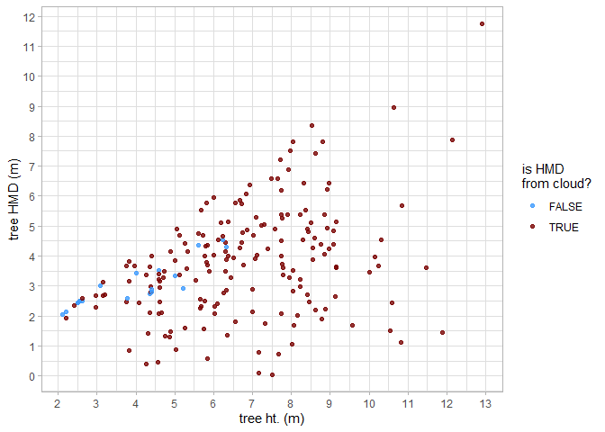

the estimates look similar but not exactly the same. let’s plot them
against each other

``` r
# get the max for the upper limit scale
ul <- max(
  trees_biomass_ans$tree_list$cruz_crown_biomass_kg
  , trees_biomass_ans$tree_list$landfire_crown_biomass_kg
)
# plot tree landfire vs. cruz crown biomass estimate
trees_biomass_ans$tree_list %>%
  ggplot2::ggplot(
    mapping = ggplot2::aes(
      x = landfire_crown_biomass_kg, y = cruz_crown_biomass_kg
    )
  ) +
  ggplot2::geom_abline(lwd = 1.5) +
  ggplot2::geom_smooth(method = "lm", se=F, color = "gray", linetype = "dashed") +
  ggplot2::geom_point(ggplot2::aes(color = tree_height_m)) +
  ggplot2::scale_x_continuous(limits = c(0, ul)) +
  ggplot2::scale_y_continuous(limits = c(0, ul))
```


let’s check out the LANDFIRE stand data

``` r
trees_biomass_ans$stand_cell_data_landfire %>% dplyr::filter(trees>0) %>% dplyr::glimpse()
#> Rows: 4
#> Columns: 19
#> $ landfire_stand_id        <dbl> 28, 29, 36, 37
#> $ x                        <dbl> -799740, -799710, -799740, -799710
#> $ y                        <dbl> 1949370, 1949370, 1949340, 1949340
#> $ area                     <dbl> 900, 900, 900, 900
#> $ pct_overlap              <dbl> 0.742080, 0.426560, 0.360384, 0.205824
#> $ overlap_area_m2          <dbl> 667.8720, 383.9040, 324.3456, 185.2416
#> $ overlap_area_ha          <dbl> 0.06678720, 0.03839040, 0.03243456, 0.01852416
#> $ rast_epsg_code           <chr> "5070", "5070", "5070", "5070"
#> $ trees                    <int> 76, 57, 39, 24
#> $ basal_area_m2            <dbl> 0.9394342, 0.4925679, 0.3439884, 0.2819664
#> $ mean_crown_length_m      <dbl> 4.267942, 3.194076, 3.995164, 4.211663
#> $ mean_crown_dia_m         <dbl> 1.660573, 1.185514, 1.654449, 1.501857
#> $ sum_crown_volume_m3      <dbl> 799.3865, 196.0506, 403.6156, 195.4602
#> $ basal_area_m2_per_ha     <dbl> 14.06608, 12.83050, 10.60561, 15.22155
#> $ trees_per_ha             <dbl> 1137.943, 1484.746, 1202.421, 1295.605
#> $ landfire_stand_kg_per_m3 <dbl> 0.11, 0.08, 0.08, 0.08
#> $ kg_per_m2                <dbl> 0.4694736, 0.2555261, 0.3196131, 0.3369330
#> $ biomass_kg               <dbl> 313.54830, 98.09750, 103.66511, 62.41401
#> $ landfire_tree_kg_per_m3  <dbl> 0.3922362, 0.5003683, 0.2568412, 0.3193183
```

this data includes the cell data (where, a “stand” is represented by a
raster cell) from the LANDFIRE Forest Canopy Bulk Density (CBD) data

we can use this stand/cell data as raster data and overlay the tree
points…let’s do this for the LANDFIRE data

``` r
# get the projection for the stand cell data
epsg_code <- trees_biomass_ans$stand_cell_data_landfire$rast_epsg_code[1] %>% as.numeric()
# plot the stand cell data with trees overlaid
trees_biomass_ans$stand_cell_data_landfire %>%
  dplyr::filter(trees>0) %>%
  ggplot2::ggplot() +
  ggplot2::geom_tile(ggplot2::aes(x=x,y=y,fill = landfire_stand_kg_per_m3), color = "gray44") +
  ggplot2::geom_text(ggplot2::aes(x=x,y=y,label = trees), color = "white") +
  ggplot2::geom_sf(
    data = trees_biomass_ans$tree_list %>% sf::st_transform(crs = epsg_code)
    , ggplot2::aes(color = cruz_crown_biomass_kg)
  ) +
  ggplot2::labs(fill="landfire\nstand kg/m3", color = "landfire\ncrown kg", caption = "# trees shown in cell") +
  ggplot2::scale_fill_viridis_c(option = "rocket", na.value = "gray", direction = -1) +
  ggplot2::scale_color_viridis_c(option = "viridis", na.value = "gray22", begin = 0.6) +
  ggplot2::theme_void()
```


